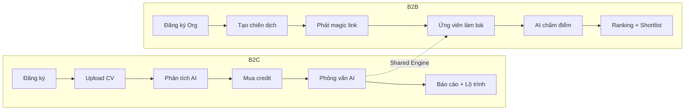
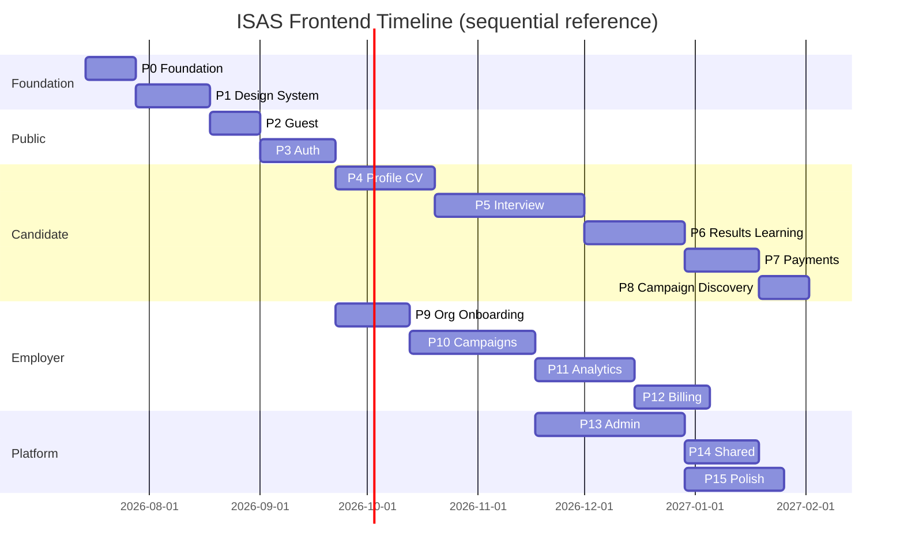
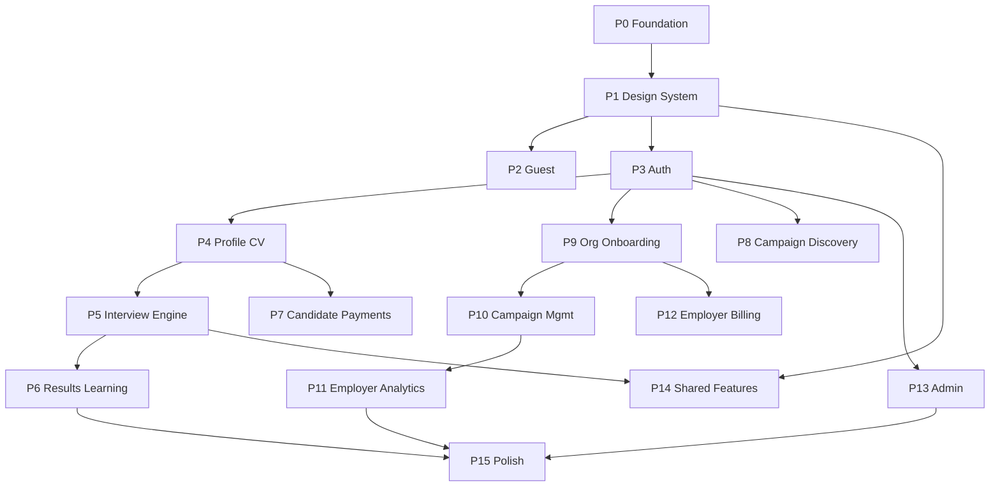

# ISAS Frontend Master Development Plan

> **Version:** 1.1  
> **Source of truth:** `AGENTS.md` + `BRD/` (greenfield — không tham chiếu code hiện tại)  
> **Audience:** Frontend team, QA, Product Owner  
> **Last updated:** 2026-07-10  
> **E2E tool:** Playwright (`@playwright/test`)

---

## Mục lục

1. [Tóm tắt điều hành](#1-tóm-tắt-điều-hành)
2. [Hiểu biết hệ thống](#2-hiểu-biết-hệ-thống) (gồm [§2.8 Playwright E2E](#28-e2e-testing-strategy--playwright))
3. [Tổng quan Phase & Timeline](#3-tổng-quan-phase--timeline)
4. [Dependency Map](#4-dependency-map)
5. [Chi tiết từng Phase](#5-chi-tiết-từng-phase)
6. [Screen Planning — 100 màn hình](#6-screen-planning--100-màn-hình)
7. [Feature Planning](#7-feature-planning)
8. [Component Planning](#8-component-planning)
9. [Master Story Backlog](#9-master-story-backlog)
10. [Development Order](#10-development-order)
11. [Kiểm tra tính đầy đủ](#11-kiểm-tra-tính-đầy-đủ)
12. [Checklist triển khai](#12-checklist-triển-khai)

---

## 1. Tóm tắt điều hành

| Metric | Giá trị |
|--------|---------|
| Tổng màn hình (BRD) | **100** |
| Functional Requirements | **289** (FR-001 → FR-289) |
| User Roles | **5** (Guest, Candidate, HR, Organize, Admin) |
| User Flows | **~60** (UF-001–307) |
| Business Rules | **70** (BRL-001–070) |
| Phases triển khai | **15** |
| Stories dự kiến | **119** |
| E2E testing | **Playwright** |
| Thời gian ước tính | **9–12 tháng** (team 3–4 FE) |

**Hai dòng sản phẩm, một engine phỏng vấn:**

| Line | `campaign_id` | Người dùng | Giá trị cốt lõi |
|------|---------------|------------|-----------------|
| **B2C** | `null` | Candidate | Tự luyện từ CV/JD, ví credit cá nhân, lịch sử |
| **B2B** | set | HR / Organize | Chiến dịch từ JD, magic link, AI chấm rubric, ranking |

---

## 2. Hiểu biết hệ thống

### 2.1 Business Domain

ISAS là nền tảng **phỏng vấn & đánh giá kỹ năng bằng AI** cho tuyển dụng (B2B) và luyện tập cá nhân (B2C). Hệ thống multi-tenant: mỗi tổ chức (Organize) có workspace riêng; ứng viên có hồ sơ cá nhân độc lập.

**Quy trình nghiệp vụ cốt lõi:**



### 2.2 Product Vision

- Giảm 40% thời gian sàng lọc, 50% chi phí phỏng vấn
- 100% ứng viên nhận phản hồi AI; correlation AI–human > 0.85
- Credit-based UX (hiển thị credits, không token cost)
- WCAG 2.2 AA; dark monochrome UI (AGENTS.md)

### 2.3 User Roles

| ID | Role | Mô tả | Phạm vi frontend |
|----|------|-------|------------------|
| ROL-001 | **Guest** | Khám phá công khai | Landing, pricing, đăng ký |
| ROL-002 | **Candidate** | Ứng viên / luyện tập B2C | Profile, CV, phỏng vấn, học tập, thanh toán cá nhân |
| ROL-003 | **HR** | Vận hành tuyển dụng | Campaign, pipeline, báo cáo (tenant-scoped) |
| ROL-004 | **Organize** | Admin tổ chức | Billing org, quản lý HR, toàn bộ báo cáo org |
| ROL-005 | **Admin** | Quản trị nền tảng | User, RBAC, AI config, audit, maintenance |

**Hierarchy:** Admin → Organize → HR → Candidate → Guest

### 2.4 Modules (M01–M12)

| Module | Tên | Priority | Phase chính |
|--------|-----|----------|-------------|
| M01 | Xác thực | Cao | P3 |
| M02 | Hồ sơ Ứng viên | Cao | P4 |
| M03 | Quản lý CV | Cao | P4 |
| M04 | Chiến dịch | Cao | P8, P10 |
| M05 | Công cụ Phỏng vấn | Cực kỳ quan trọng | P5 |
| M06 | Đánh giá AI | Cực kỳ quan trọng | P5, P6 |
| M07 | Trung tâm Học tập | Trung bình | P6 |
| M08 | Thanh toán | Cao | P7, P12 |
| M09 | Báo cáo | Cao | P11, P14 |
| M10 | Thông báo | Trung bình | P14 |
| M11 | Cổng Quản trị | Cao | P13 |
| M12 | Kiểm toán | Trung bình | P13 |

### 2.5 Integration (frontend)

- **Gateway:** `/api/v1/<service>/...` (Auth, Interview, Campaign, Payment)
- **File upload:** Pre-signed URL (SeaweedFS/S3)
- **Payment:** PayOS redirect/iframe
- **AI:** Polling/WebSocket qua Gateway (không gọi AIService trực tiếp)
- **Notifications:** In-app + browser push; email/SMS server-triggered

### 2.6 Security (frontend)

- JWT + refresh; HttpOnly cookies; 15min idle / 12h absolute session
- RBAC route guards; MFA cho Admin/Employer
- Consent trước camera/mic; PII masking theo role
- Client validation: VR-001–015; upload PDF/DOCX max 10MB

### 2.7 UI/UX Constraints (AGENTS.md)

- **Dark mode only** — monochrome (white/black/gray) cho UI cấu trúc
- Semantic colors chỉ cho success/error/warning/info
- Surface layers: `surface-base` → `surface-elevated`
- Left sidebar navigation (role-based); WCAG 2.2 AA

### 2.8 E2E Testing Strategy — Playwright

**Quyết định:** Toàn bộ end-to-end testing dùng **[Playwright](https://playwright.dev)** (`@playwright/test`). Không dùng Cypress hoặc Selenium.

| Khía cạnh | Quy ước |
|-----------|---------|
| **Cài đặt** | P0 — scaffold sớm (`e2e/`, `playwright.config.ts`) |
| **Browsers** | Chromium, Firefox, WebKit (Safari) — khớp BRD constraint Chrome/Edge/Safari |
| **Cấu trúc thư mục** | `e2e/fixtures/`, `e2e/pages/` (Page Object Model), `e2e/specs/` |
| **Naming** | `e2e/specs/{domain}/{flow}.spec.ts` — ví dụ `e2e/specs/b2c/practice-interview.spec.ts` |
| **Auth** | `e2e/fixtures/auth.ts` — `storageState` reuse sau login |
| **API helpers** | `e2e/fixtures/api.ts` — seed data / cleanup qua Gateway (không bypass UI khi test flow) |
| **Media mock** | `e2e/fixtures/media.ts` — fake camera/mic cho interview room (WebRTC) |
| **CI** | `npx playwright test` trên PR; upload `playwright-report` khi fail |
| **Scripts** | `npm run test:e2e`, `npm run test:e2e:ui`, `npm run test:e2e:headed` |

**Phân tầng test (không nhầm với E2E):**

| Lớp | Tool | Khi nào |
|-----|------|---------|
| Unit / component | Vitest + Testing Library | Logic, hooks, UI states đơn lẻ |
| Integration | Vitest + MSW | API client, form submit handlers |
| **E2E** | **Playwright** | User flows hoàn chỉnh B2C/B2B (P15 + smoke per milestone) |

**Smoke E2E theo milestone (chạy sớm, mở rộng dần):**

| Milestone | Playwright spec tối thiểu |
|-----------|---------------------------|
| M1 | `e2e/specs/smoke/landing.spec.ts`, `auth-login.spec.ts` |
| M2 | `e2e/specs/b2c/cv-upload.spec.ts`, `interview-happy-path.spec.ts` (mock media) |
| M3 | `e2e/specs/b2c/payment-credits.spec.ts` (PayOS sandbox) |
| M4 | `e2e/specs/b2b/campaign-invite-interview.spec.ts` |
| M5 | Full regression — `e2e/specs/b2c/full-journey.spec.ts`, `e2e/specs/b2b/full-journey.spec.ts` |

**Interview room (P5):** Playwright `context.grantPermissions(['camera', 'microphone'])` + fake media stream fixture — không phụ thuộc hardware thật trong CI.

---

## 3. Tổng quan Phase & Timeline

| Phase | Tên | Business Value | Screens | Stories | Ước tính |
|-------|-----|----------------|---------|---------|----------|
| **P0** | Foundation | Có thể build & deploy | 0 | 7 | 2 tuần |
| **P1** | Design System | UI nhất quán, a11y | 12 (shared) | 10 | 3 tuần |
| **P2** | Guest Experience | Acquisition funnel | 2 | 4 | 2 tuần |
| **P3** | Authentication | Secure access | 11 | 9 | 3 tuần |
| **P4** | Candidate Profile & CV | Data foundation B2C/B2B | 11 | 10 | 4 tuần |
| **P5** | Interview Engine | Core product value | 8 | 12 | 6 tuần |
| **P6** | Results & Learning | Post-interview value | 12 | 9 | 4 tuần |
| **P7** | Candidate Payments | B2C monetization | 3 | 5 | 3 tuần |
| **P8** | Campaign Discovery | B2B candidate entry | 3 | 4 | 2 tuần |
| **P9** | Organization Onboarding | B2B tenant setup | 3 | 5 | 3 tuần |
| **P10** | Campaign Management | B2B core workflow | 6 | 8 | 5 tuần |
| **P11** | Employer Analytics | Hiring decisions | 5 | 6 | 4 tuần |
| **P12** | Employer Billing | B2B monetization | 4 | 5 | 3 tuần |
| **P13** | Admin Platform | Platform operations | 20 | 14 | 6 tuần |
| **P14** | Shared Features | Cross-cutting UX | 5 | 7 | 3 tuần |
| **P15** | Polish & Production | Ship-ready quality | — | 8 | 4 tuần |

**Tổng:** ~52 tuần (có overlap song song 3–4 dev → **9–12 tháng**)



---

## 4. Dependency Map



**Critical path:** P0 → P1 → P3 → P4 → P5 → P6 → P15

**Parallel tracks sau P3:**
- Track A (Candidate): P4 → P5 → P6 → P7 → P8
- Track B (Employer): P9 → P10 → P11 → P12
- Track C (Platform): P13, P14

---

## 5. Chi tiết từng Phase

> Mỗi Phase = **vertical slice** hoàn chỉnh theo giá trị nghiệp vụ. Template áp dụng cho tất cả phases.

---

### Phase 0 — Foundation

| Field | Chi tiết |
|-------|----------|
| **Mục tiêu** | Khởi tạo monolith web client có thể build, route, gọi API, quản lý session shell |
| **Business Value** | Nền tảng kỹ thuật — mọi feature sau đứng trên cùng một skeleton |
| **Vai trò** | Tất cả (infrastructure) |
| **Screens** | — (chưa có UI nghiệp vụ) |
| **User Flows** | — |
| **Features** | App bootstrap, env config, API client, routing shell, error boundary, **Playwright scaffold** |
| **Components** | — (dùng P1) |
| **Shared Modules** | `api-client`, `auth-store`, `query-client`, `router`, `env`, `e2e/` (Playwright) |
| **State** | React Query global; Zustand/Context cho auth shell |
| **API** | Health check `GET /api/v1/auth/health`; base axios/fetch với interceptors |
| **Routing** | React Router v6; route groups: `(public)`, `(auth)`, `(candidate)`, `(employer)`, `(admin)` |
| **Layout** | `RootLayout` (providers only); chưa có sidebar |
| **Validation** | Env schema (zod); API error normalizer |
| **Error Handling** | Global error boundary; 401 interceptor → redirect login |
| **Loading** | `Suspense` fallback; route-level loading |
| **Empty** | — |
| **Permission** | Route guard HOC skeleton (`RequireAuth`, `RequireRole`) |
| **Deliverables** | Repo scaffold, CI lint/build, dev server, env template, `playwright.config.ts`, smoke spec |
| **DoD** | `npm run build` pass; `npm run test:e2e` chạy được (smoke pass hoặc skip có lý do) |
| **Acceptance** | Dev mới clone → `npm install && npm run dev` → thấy blank app; `npx playwright test` green |
| **Dependencies** | Gateway URL configured |
| **Rủi ro** | Gateway chưa sẵn sàng → mock MSW |
| **Ghi chú** | Harness CLI init; không implement UI nghiệp vụ |

---

### Phase 1 — Design System

| Field | Chi tiết |
|-------|----------|
| **Mục tiêu** | Xây bộ component primitives monochrome dark theo AGENTS.md + UI_GUIDE |
| **Business Value** | Nhất quán thương hiệu; giảm 60% thời gian build screen sau |
| **Vai trò** | Tất cả |
| **Screens** | SCR-SHR-089–100 (error, loading, empty, dialogs) |
| **User Flows** | — |
| **Features** | Token system, atoms, molecules, layout primitives |
| **Components** | Button, Input, Label, Card, Modal, Toast, Alert, Badge, Avatar, Checkbox, Select, Tabs, Table, Skeleton, Spinner, Breadcrumb, Sidebar, Header, PageHeader, EmptyState, ErrorPage, ConfirmDialog, FileUploadDialog, SessionTimeoutDialog |
| **Shared** | `cn()`, `colors.css`, `index.css` utilities |
| **State** | Toast provider; modal stack context |
| **API** | — |
| **Routing** | `/dev/components` harness (internal only, không ship prod) |
| **Layout** | `AppShell`, `DashboardLayout`, `AuthLayout`, `FullscreenLayout` |
| **Validation** | Form field error display pattern |
| **Error** | SCR-SHR-090/091/092 reusable |
| **Loading** | SCR-SHR-093; button loading state |
| **Empty** | SCR-SHR-094 variants (no-data, no-results, no-permission) |
| **Permission** | — |
| **Deliverables** | `src/components/ui/*`, style tokens, Storybook/harness |
| **DoD** | WCAG 2.2 AA contrast pass; keyboard nav all interactives; dark only |
| **Acceptance** | Mọi primitive có 6 states: default, hover, focus, active, disabled, loading |
| **Dependencies** | P0 |
| **Rủi ro** | Drift khỏi monochrome → enforce lint |
| **Ghi chú** | Semantic colors chỉ toast/alert/badge/chart |

---

### Phase 2 — Guest Experience

| Field | Chi tiết |
|-------|----------|
| **Mục tiêu** | Landing marketing + employer section cho acquisition |
| **Business Value** | Conversion funnel; KPI-001 registration > 40% |
| **Vai trò** | Guest (ROL-001) |
| **Screens** | SCR-AUT-001 (Welcome/Landing), SCR-AUT-011 (Terms & Privacy) |
| **User Flows** | Guest: Landing → Features → Pricing → Register |
| **Features** | F-GUEST-001 Home, F-GUEST-002 Pricing, F-GUEST-003 Legal pages |
| **Components** | Hero, FeatureGrid, PricingTable, CTAButton, Footer, NavBar |
| **Shared** | `MarketingLayout` |
| **State** | Static content; optional CMS hook (admin P13) |
| **API** | `GET /api/v1/campaign/public` (public campaigns preview) |
| **Routing** | `/`, `/pricing`, `/employers`, `/terms`, `/privacy` |
| **Layout** | `MarketingLayout` (no sidebar) |
| **Validation** | — |
| **Error** | 404/500 từ P1 |
| **Loading** | Page skeleton |
| **Empty** | No public campaigns → hide section |
| **Permission** | Public routes; no auth required |
| **Deliverables** | Landing page, pricing, legal, employer CTA section |
| **DoD** | LCP < 2.5s; responsive 320–1440px; SEO meta tags |
| **Acceptance** | Guest xem landing → click CTA → mở register (P3) |
| **Dependencies** | P1 |
| **Rủi ro** | Content chưa final → placeholder copy approved by PO |
| **Ghi chú** | FR không map trực tiếp; hỗ trợ BRQ acquisition |

---

### Phase 3 — Authentication

| Field | Chi tiết |
|-------|----------|
| **Mục tiêu** | Toàn bộ identity lifecycle: register, login, SSO, MFA, password reset, session |
| **Business Value** | Secure gate cho mọi giá trị phía sau; tenant isolation |
| **Vai trò** | Guest → Candidate/HR/Admin |
| **Screens** | SCR-AUT-002–010 (11 screens auth) |
| **User Flows** | UF-001–004, UF-030; Employer UF-101 |
| **Features** | F-AUTH-001–009 (xem §7) |
| **Components** | AuthModal, LoginForm, RegisterForm, MFAChallenge, PasswordStrengthMeter, SSOButton, SocialLoginButton |
| **Shared** | `useAuth`, `AuthProvider`, `session-manager` |
| **State** | JWT in HttpOnly cookie; user profile in React Query; idle timer |
| **API** | Auth: register, login, logout, refresh, verify-email, forgot/reset password, MFA verify, SSO redirect |
| **Routing** | `/login`, `/register`, `/verify-email`, `/forgot-password`, `/reset-password/:token`, `/mfa`, `/session-expired`, `/access-denied`, `/account-locked` |
| **Layout** | `AuthLayout` (centered card) |
| **Validation** | VR-001–002, VR-005; SEC-012 password 12+ chars |
| **Error** | ERR-001–005, ERR-034; lockout UI (SEC-013) |
| **Loading** | Submit button loading; SSO redirect spinner |
| **Empty** | — |
| **Permission** | Post-login redirect by role; email verify gate (BR-01) |
| **Deliverables** | Full auth flows B2C + B2B SSO entry |
| **DoD** | Register → verify email → login → dashboard redirect; MFA for admin |
| **Acceptance** | FR-001–003; BRL-019 admin MFA; SEC-018/019 timeouts |
| **Dependencies** | P1, P2; AuthService API |
| **Rủi ro** | SSO config per tenant → feature flag |
| **Ghi chú** | Modal auth trên landing HOẶC dedicated pages — chọn dedicated pages cho a11y |

---

### Phase 4 — Candidate Profile & CV

| Field | Chi tiết |
|-------|----------|
| **Mục tiêu** | Hồ sơ ứng viên đầy đủ + upload/phân tích CV |
| **Business Value** | Data foundation cho phỏng vấn AI; auto-fill từ CV (FR-006) |
| **Vai trò** | Candidate (ROL-002) |
| **Screens** | SCR-CAN-012–022 (Dashboard, Profile sections, CV) |
| **User Flows** | UF-005–007, UF-027 |
| **Features** | F-PROF-001–008, F-CV-001–003 |
| **Components** | ProfileWizard, EducationForm, ExperienceForm, SkillsTagInput, CertificateCard, PortfolioGallery, CVUploader, CVAnalysisPanel, ProfileCompletenessBar |
| **Shared** | `ProfileSectionLayout`, CRUD list pattern |
| **State** | React Query per entity; optimistic updates for profile edits |
| **API** | Auth profile CRUD; CV upload presign + parse status poll; FR-004–006 |
| **Routing** | `/candidate/dashboard`, `/candidate/profile`, `/candidate/profile/complete`, `/candidate/profile/{section}`, `/candidate/cv/upload`, `/candidate/cv/analysis` |
| **Layout** | `CandidateDashboardLayout` (sidebar) |
| **Validation** | VR-006–007 CV; BRL-018/046/067; profile 70% rule (BRL-032) |
| **Error** | ERR-021–025 CV errors |
| **Loading** | CV parse progress (45s SLA BRL-051) |
| **Empty** | No CV → guided upload; incomplete profile CTA |
| **Permission** | Candidate owns data only (BR-001) |
| **Deliverables** | Profile CRUD all sections; CV upload + analysis UI |
| **DoD** | Upload CV → see parsed fields → map to profile; completeness % shown |
| **Acceptance** | FR-004–006, FR-020–059 (profile entities); UF-005–007 |
| **Dependencies** | P3; Interview file API |
| **Rủi ro** | Parse fail rate → manual edit fallback UI |
| **Ghi chú** | Progressive disclosure — wizard for first-time |

---

### Phase 5 — Interview Engine

| Field | Chi tiết |
|-------|----------|
| **Mục tiêu** | End-to-end AI interview room — core engine dùng chung B2C & B2B |
| **Business Value** | **Heart of product** — phỏng vấn AI async, proctoring, recording |
| **Vai trò** | Candidate |
| **Screens** | SCR-CAN-029–035 (Prep → Session → Complete) |
| **User Flows** | UF-011–017 (UF-014 P0 critical path) |
| **Features** | F-INT-001–009 |
| **Components** | InterviewPrepChecklist, DeviceCheckPanel, IdentityVerifyCamera, WaitingRoom, **InterviewRoom** (video, AI avatar, timer, question panel, record controls), PauseOverlay, ProctoringAlertBanner, NetworkLossDialog, ConsentModal |
| **Shared** | `useMediaDevices`, `useInterviewSession`, WebRTC recorder |
| **State** | Session state machine: `preparing → device_check → identity → waiting → active → paused → completing → done`; Zustand for realtime UI |
| **API** | Interview: create session, device check, identity verify, start/pause/resume/complete, upload chunks, question poll, proctoring events |
| **Routing** | `/interview/:sessionId/prepare`, `/device-check`, `/identity`, `/waiting`, `/room` (fullscreen), `/complete` |
| **Layout** | `FullscreenLayout` (no sidebar; lock tab) |
| **Validation** | Camera/mic required (BRL-025); consent (SEC-025) |
| **Error** | ERR-011–020 interview errors |
| **Loading** | "Generating next question..." (ERR-015) |
| **Empty** | — |
| **Permission** | Email verified (BR-01); credits ≥ 1 (BR-05); one active session (BRL-005) |
| **Deliverables** | Reusable interview room (D1); B2C practice + B2B magic-link entry |
| **DoD** | Full UF-014: start → Q&A loop → proctoring → complete → upload |
| **Acceptance** | FR-009–013; KPI-003 completion > 75%; abandonment < 10% |
| **Dependencies** | P4; InterviewService + file storage |
| **Rủi ro** | WebRTC browser compat → Chromium/Safari only; dual-camera (BRL-049) Phase 5.1 |
| **Ghi chú** | Timer: orange 2min, red 30s; auto-submit on timeout (BRL-042) |

---

### Phase 6 — Results, History & Learning

| Field | Chi tiết |
|-------|----------|
| **Mục tiêu** | AI report, feedback, learning hub, certificates, history |
| **Business Value** | Retention & skill development; 100% candidates get AI feedback |
| **Vai trò** | Candidate |
| **Screens** | SCR-CAN-036–048 (Report, Learning, Progress, History) |
| **User Flows** | UF-018–026, UF-028 |
| **Features** | F-RESULT-001–005, F-LEARN-001–004, F-HIST-001 |
| **Components** | ScoreDial, RadarChart, SkillBreakdownAccordion, RoadmapTimeline, LearningModuleCard, ProgressDashboard, LeaderboardTable, AchievementBadge, CertificateViewer, HistoryTable |
| **Shared** | `ReportTabs` (Overview/Breakdown/Roadmap) |
| **State** | Poll assessment status until `scored`; cache reports |
| **API** | Assessment results, roadmap, learning modules, certificates, history list |
| **Routing** | `/candidate/results/:id`, `/candidate/learning`, `/candidate/learning/:moduleId`, `/candidate/progress`, `/candidate/certificates/:id`, `/candidate/history` |
| **Layout** | `CandidateDashboardLayout` |
| **Validation** | Roadmap regen limit (BRL-026); learning pass 80% (BRL-011) |
| **Error** | Score not ready → polling UI |
| **Loading** | AI scoring spinner (KPI-005 < 3min) |
| **Empty** | No history → CTA practice; no roadmap → trigger generation |
| **Permission** | BRL-023 feedback disclosure lock |
| **Deliverables** | Full post-interview experience |
| **DoD** | Complete interview → view report → see roadmap → start learning module |
| **Acceptance** | FR-014–019, FR-018–019; UF-018–026 |
| **Dependencies** | P5 |
| **Rủi ro** | AI latency → async notification (NOTI-048) |
| **Ghi chú** | Compare results (UF-019) optional P6.1 |

---

### Phase 7 — Candidate Payments & Credits

| Field | Chi tiết |
|-------|----------|
| **Mục tiêu** | B2C credit wallet, subscription, checkout PayOS |
| **Business Value** | B2C monetization; credit gate trước phỏng vấn |
| **Vai trò** | Candidate |
| **Screens** | SCR-CAN-026–028 |
| **User Flows** | UF-010 |
| **Features** | F-PAY-C-001–003 |
| **Components** | CreditBalanceWidget, PackageCard, CheckoutFlow, PaymentStatusBanner, TransactionHistory |
| **Shared** | `useCredits`, payment redirect handler |
| **State** | Credit balance in React Query; checkout session |
| **API** | Payment: packages, create order, wallet balance, transaction log; PayOS redirect |
| **Routing** | `/candidate/payment`, `/candidate/credits`, `/candidate/subscription`, `/payment/callback` |
| **Layout** | `CandidateDashboardLayout` |
| **Validation** | VR-009 min 1 credit; BRL-062 no negative balance |
| **Error** | ERR-006–010 payment errors |
| **Loading** | Checkout redirect; webhook poll |
| **Empty** | Zero credits → block interview CTA |
| **Permission** | Authenticated candidate only |
| **Deliverables** | Buy credits → wallet updated → interview unlocked |
| **DoD** | E2E: purchase → credit +1 → interview consumes 1 |
| **Acceptance** | FR-160–194 (payment views); UF-010; BRL-003 USD |
| **Dependencies** | P3; PaymentService + PayOS sandbox |
| **Rủi ro** | PayOS sandbox vs prod → env switch |
| **Ghi chú** | Show credits not token costs (D4/D15) |

---

### Phase 8 — Campaign Discovery (Candidate B2B Entry)

| Field | Chi tiết |
|-------|----------|
| **Mục tiêu** | Ứng viên khám phá & tham gia chiến dịch B2B |
| **Business Value** | B2B candidate funnel; magic link landing |
| **Vai trò** | Candidate |
| **Screens** | SCR-CAN-023–025 |
| **User Flows** | UF-008–009; magic link from UF-106 |
| **Features** | F-CAMP-C-001–003 |
| **Components** | CampaignCard, CampaignDetailHero, EnrollmentForm, MagicLinkLanding |
| **State** | Campaign list filters; enrollment status |
| **API** | Campaign: public list, detail, enroll; magic link validate |
| **Routing** | `/candidate/campaigns`, `/candidate/campaigns/:id`, `/candidate/campaigns/:id/enroll`, `/invite/:token` |
| **Layout** | `CandidateDashboardLayout` / `AuthLayout` for magic link |
| **Validation** | Profile 70% (BRL-032); invite expiry 14d (BRL-022) |
| **Error** | Expired invite → clear message |
| **Loading** | Campaign list skeleton |
| **Empty** | No campaigns → explore CTA |
| **Permission** | Public browse; enroll requires auth + profile |
| **Deliverables** | Campaign discovery + enrollment + magic link entry to P5 |
| **DoD** | Magic link → enroll → interview prep (P5) |
| **Acceptance** | FR-095–124 (candidate-facing); UF-008–009 |
| **Dependencies** | P4, P5; CampaignService |
| **Rủi ro** | Campaign locale match (BRL-059) |
| **Ghi chú** | `/invite/:token` reuses interview engine |

---

### Phase 9 — Organization Onboarding

| Field | Chi tiết |
|-------|----------|
| **Mục tiêu** | Employer registration, company profile, verification |
| **Business Value** | B2B tenant activation |
| **Vai trò** | Organize (ROL-004), HR (ROL-003) |
| **Screens** | SCR-EMP-052–054 |
| **User Flows** | UF-101–102 |
| **Features** | F-ORG-001–003 |
| **Components** | CompanyProfileForm, VerificationUpload, OrgDashboardSkeleton |
| **State** | Org context (tenant ID) in auth store |
| **API** | Auth org register; company profile CRUD; verification submit |
| **Routing** | `/employer/dashboard`, `/employer/company`, `/employer/company/verify` |
| **Layout** | `EmployerDashboardLayout` |
| **Validation** | Corporate email only (BRL-052); VR-001 |
| **Error** | Verification rejected → resubmit flow |
| **Loading** | Verification pending badge |
| **Empty** | New org → onboarding wizard |
| **Permission** | Organize full; HR read company |
| **Deliverables** | Org signup → company profile → verification submitted |
| **DoD** | B2B register → company profile 100% → pending verification |
| **Acceptance** | FR-060–064; UF-101–102; SEC-011 MFA setup prompt |
| **Dependencies** | P3 |
| **Rủi ro** | Manual verification delay → allow draft campaigns |
| **Ghi chú** | SSO (FR-002) for enterprise — P9.1 |

---

### Phase 10 — Campaign Management (HR)

| Field | Chi tiết |
|-------|----------|
| **Mục tiêu** | CRUD chiến dịch, rubric, invite candidates, publish |
| **Business Value** | **B2B core** — tạo assessment campaign từ JD |
| **Vai trò** | HR (ROL-003) |
| **Screens** | SCR-EMP-055–058 |
| **User Flows** | UF-103–106, UF-111 |
| **Features** | F-CAMP-E-001–006 |
| **Components** | CampaignWizard (JD → rubric → questions → settings), CampaignTable, CampaignStatusBadge, InviteCandidatesModal, RubricWeightEditor, QuestionBankPicker |
| **State** | Multi-step wizard state; draft autosave |
| **API** | Campaign CRUD, publish, invite, rubric, question bank; FR-095–124, FR-125–159 |
| **Routing** | `/employer/campaigns`, `/employer/campaigns/new`, `/employer/campaigns/:id`, `/employer/campaigns/:id/edit` |
| **Layout** | `EmployerDashboardLayout` |
| **Validation** | Rubric weights sum 100% (BRL-036); publish rules (BRL-012); max 5 active (BRL-031) |
| **Error** | Publish validation errors inline |
| **Loading** | Save draft indicator |
| **Empty** | No campaigns → create CTA |
| **Permission** | HR tenant-scoped; Organize can delete |
| **Deliverables** | Full campaign lifecycle draft → published → invites sent |
| **DoD** | Create campaign → publish → invite → candidate receives link |
| **Acceptance** | FR-007–008, FR-095–124; UF-103–106 |
| **Dependencies** | P9; CampaignService |
| **Rủi ro** | Complex wizard → split into substeps with save |
| **Ghi chú** | JD paste → AI question gen (backend); UI shows generation status |

---

### Phase 11 — Employer Analytics & Candidate Pipeline

| Field | Chi tiết |
|-------|----------|
| **Mục tiêu** | Pipeline ứng viên, AI reports, ranking, analytics |
| **Business Value** | Hiring decisions; time-to-hire KPI |
| **Vai trò** | HR, Organize |
| **Screens** | SCR-EMP-059–062 |
| **User Flows** | UF-107–108, UF-110, UF-112 |
| **Features** | F-PIPE-001–004 |
| **Components** | CandidatePipelineTable, CandidateProfileDrawer, AIReportSummary, RankingLeaderboard, AnalyticsDashboard, SparklineMetricCard, ExportButton |
| **State** | Table filters/sort/pagination; bulk select |
| **API** | Campaign candidates, scores, ranking, analytics, export CSV |
| **Routing** | `/employer/campaigns/:id/candidates`, `/employer/candidates/:id`, `/employer/reports`, `/employer/analytics` |
| **Layout** | `EmployerDashboardLayout` |
| **Validation** | Search sanitization (VR-013); bulk export max 10k (BRL-041) |
| **Error** | Export too large → async email |
| **Loading** | Table skeleton; report generation |
| **Empty** | No candidates → invite CTA |
| **Permission** | HR notes hidden from candidate (BR-004); blind hiring (BRL-064) |
| **Deliverables** | View ranked candidates → drill report → export |
| **DoD** | 10+ candidates → sort by score → export CSV |
| **Acceptance** | FR-195–224 (reports); UF-107–108, UF-110 |
| **Dependencies** | P10, P5, P6 |
| **Rủi ro** | PII in exports → masking (BRL-015) |
| **Ghi chú** | Score override needs 20+ char note (BRL-066) |

---

### Phase 12 — Employer Billing

| Field | Chi tiết |
|-------|----------|
| **Mục tiêu** | Org subscription, billing, invoices |
| **Business Value** | B2B monetization |
| **Vai trò** | Organize |
| **Screens** | SCR-EMP-063–065 |
| **User Flows** | UF-109, UF-114 |
| **Features** | F-PAY-E-001–003 |
| **Components** | SubscriptionPlanSelector, BillingOverview, InvoiceTable, PaymentMethodForm |
| **State** | Org billing context |
| **API** | Payment org: subscription, invoices, payment methods |
| **Routing** | `/employer/subscription`, `/employer/billing`, `/employer/invoices` |
| **Layout** | `EmployerDashboardLayout` |
| **Validation** | VR-010–012 card validation |
| **Error** | Grace period block (BRL-013) |
| **Loading** | Invoice PDF generation (BRL-024 60s) |
| **Empty** | No subscription → upgrade CTA |
| **Permission** | Organize only for billing |
| **Deliverables** | Subscribe → invoice → credit pool for org |
| **DoD** | Org purchase → credits available for campaigns |
| **Acceptance** | FR-160–194 (org views); UF-109, UF-114 |
| **Dependencies** | P9; PaymentService |
| **Rủi ro** | Multi-seat billing (BRL-021) |
| **Ghi chú** | Low credit alerts NOTI-084/085 |

---

### Phase 13 — Admin Platform

| Field | Chi tiết |
|-------|----------|
| **Mục tiêu** | Platform administration — users, RBAC, AI config, audit, maintenance |
| **Business Value** | Operability, compliance, multi-tenant governance |
| **Vai trò** | Admin (ROL-005) |
| **Screens** | SCR-ADM-069–088 (20 screens) |
| **User Flows** | UF-201–213 |
| **Features** | F-ADM-001–012 |
| **Components** | AdminDataTable, RolePermissionMatrix, AuditLogViewer, AIConfigForm, FeatureFlagToggle, SystemHealthPanel, MaintenanceScheduler, SupportTicketQueue |
| **State** | Admin session (single session BRL-033); re-auth modal (SEC-017) |
| **API** | Admin APIs: users, roles, permissions, tenants, AI config, audit, system config |
| **Routing** | `/admin/*` (nested resource routes) |
| **Layout** | `AdminDashboardLayout` |
| **Validation** | Dual-sign for config (BRL-053) |
| **Error** | Immutable audit warning |
| **Loading** | Heavy tables paginated |
| **Empty** | Per-resource empty states |
| **Permission** | Admin only; MFA required (BRL-019) |
| **Deliverables** | Full admin portal per screen inventory |
| **DoD** | Admin login MFA → manage user → view audit → schedule maintenance |
| **Acceptance** | FR-255–289; UF-201–213 |
| **Dependencies** | P3; all services admin APIs |
| **Rủi ro** | Scope creep → prioritize P13.0: users, audit, AI config |
| **Ghi chú** | Impersonation (FR-280) audit-logged |

---

### Phase 14 — Shared Cross-Cutting Features

| Field | Chi tiết |
|-------|----------|
| **Mục tiêu** | Notifications, settings, help/support, reporting widgets dùng chung |
| **Business Value** | Engagement, self-service, operational visibility |
| **Vai trò** | Candidate, HR, Admin |
| **Screens** | SCR-CAN-047–051, SCR-EMP-066–068, SCR-SHR-095 |
| **User Flows** | UF-028–029, UF-113, UF-115 |
| **Features** | F-NOTIF-001–003, F-SETTINGS-001, F-SUPPORT-001 |
| **Components** | NotificationCenter, NotificationBell, SettingsForm, HelpCenter, SupportTicketForm, TeamMemberTable |
| **State** | Notification unread count; preferences per category |
| **API** | Notifications list/mark-read; settings; support tickets |
| **Routing** | `/*/notifications`, `/*/settings`, `/*/help`, `/*/support` |
| **Layout** | Per-role dashboard layout |
| **Validation** | Opt-out marketing (BRL-040) |
| **Error** | Delivery failure toast |
| **Loading** | Notification polling / WebSocket |
| **Empty** | No notifications → SCR-SHR-094 |
| **Permission** | Per-role settings scope |
| **Deliverables** | Notification center + preferences + support entry |
| **DoD** | Trigger NOTI-048 → appears in-app < 2s |
| **Acceptance** | FR-225–254; NOTI-001–137 surfaces |
| **Dependencies** | P3, P6, P10 |
| **Rủi ro** | 137 notification types → phase rollout by category |
| **Ghi chú** | Quiet hours + dedupe per Notifications.md |

---

### Phase 15 — Polish, QA & Production Ready

| Field | Chi tiết |
|-------|----------|
| **Mục tiêu** | Performance, a11y audit, **Playwright E2E regression**, security hardening, production deploy |
| **Business Value** | Ship confidence; SLA compliance |
| **Vai trò** | Tất cả |
| **Screens** | Tất cả — Playwright regression pass |
| **User Flows** | `e2e/specs/b2c/full-journey.spec.ts` + `e2e/specs/b2b/full-journey.spec.ts` |
| **Features** | Performance budgets, error monitoring, analytics, Playwright CI gate |
| **Components** | — (harden existing) |
| **State** | — |
| **API** | — |
| **Routing** | 404 catch-all; maintenance mode (SCR-SHR-092) |
| **Layout** | — |
| **Validation** | Full VR regression |
| **Error** | Sentry integration |
| **Loading** | CLS < 0.1 |
| **Empty** | — |
| **Permission** | Pen-test RBAC |
| **Deliverables** | Lighthouse > 90; Playwright full suite; `playwright-report` CI artifact; deploy runbook |
| **DoD** | `npx playwright test` pass (3 browsers); B2C + B2B journey specs green; WCAG audit pass |
| **Acceptance** | Acceptance_Criteria.md DEL-001–015 |
| **Dependencies** | All phases |
| **Rủi ro** | Scope of 90 reports (RPT) → MVP subset |
| **Ghi chú** | SUS > 80 target; xem §2.8 Playwright strategy |

---

## 6. Screen Planning — 100 màn hình

> **Route convention:** `/{role-segment}/{resource}/{action}` · Layout: `MKT`=Marketing, `AUTH`=Auth, `CDL`=Candidate Dashboard, `EDL`=Employer Dashboard, `ADL`=Admin, `FS`=Fullscreen, `SHR`=Shared overlay/page

### 6.1 Authentication (11)

| Screen ID | Name | Feature | Module | Role | Route | Layout | Key Components | Business Rules | User Actions | API | Deps | Phase |
|-----------|------|---------|--------|------|-------|--------|----------------|----------------|--------------|-----|------|-------|
| SCR-AUT-001 | Chào mừng | F-GUEST-001 | M01 | Guest | `/` | MKT | Hero, CTA, NavBar | — | Browse, Register, Login | public campaigns | — | P2 |
| SCR-AUT-002 | Đăng nhập | F-AUTH-002 | M01 | All | `/login` | AUTH | LoginForm, SSOButton | SEC-013 lockout | Login, SSO, Forgot | POST login | — | P3 |
| SCR-AUT-003 | Đăng ký | F-AUTH-001 | M01 | Guest | `/register` | AUTH | RegisterForm | BRL-039 age≥16 | Register | POST register | — | P3 |
| SCR-AUT-004 | Xác minh Email | F-AUTH-003 | M01 | Candidate | `/verify-email` | AUTH | VerifyBanner, ResendLink | BR-01 | Verify, Resend | POST verify | P3 | P3 |
| SCR-AUT-005 | Quên mật khẩu | F-AUTH-004 | M01 | All | `/forgot-password` | AUTH | EmailForm | — | Submit email | POST forgot | — | P3 |
| SCR-AUT-006 | Đặt lại mật khẩu | F-AUTH-005 | M01 | All | `/reset-password/:token` | AUTH | PasswordForm | VR-002, BRL-047 | Reset | POST reset | — | P3 |
| SCR-AUT-007 | Xác minh 2 bước | F-AUTH-006 | M01 | All | `/mfa` | AUTH | MFAChallenge | BRL-019 admin | Enter OTP | POST mfa | P3 | P3 |
| SCR-AUT-008 | Hết hạn phiên | F-AUTH-007 | M01 | All | `/session-expired` | AUTH | SessionExpired | SEC-018/019 | Re-login | — | P3 | P3 |
| SCR-AUT-009 | Từ chối truy cập | F-AUTH-008 | M01 | All | `/access-denied` | SHR | ErrorPage 403 | SEC-016 | Go back | — | P1 | P3 |
| SCR-AUT-010 | Khóa tài khoản | F-AUTH-009 | M01 | All | `/account-locked` | AUTH | LockedMessage | ERR-002 | Contact support | — | — | P3 |
| SCR-AUT-011 | Điều khoản & Bảo mật | F-GUEST-003 | M01 | Guest | `/terms`, `/privacy` | MKT | LegalContent | — | Read | — | — | P2 |

### 6.2 Candidate (40)

| Screen ID | Name | Feature | Module | Role | Route | Layout | Key Components | Business Rules | User Actions | API | Deps | Phase |
|-----------|------|---------|--------|------|-------|--------|----------------|----------------|--------------|-----|------|-------|
| SCR-CAN-012 | Bảng điều khiển | F-PROF-001 | M02 | Candidate | `/candidate/dashboard` | CDL | MetricCards, UpcomingList | — | View summary | dashboard API | P3 | P4 |
| SCR-CAN-013 | Hồ sơ | F-PROF-002 | M02 | Candidate | `/candidate/profile` | CDL | ProfileHeader, SectionNav | BR-001 | View, Edit | profile GET | P3 | P4 |
| SCR-CAN-014 | Hoàn thiện hồ sơ | F-PROF-003 | M02 | Candidate | `/candidate/profile/complete` | CDL | ProfileWizard | BRL-032 70% | Complete wizard | profile PATCH | P4 | P4 |
| SCR-CAN-015 | Mục tiêu nghề nghiệp | F-PROF-004 | M02 | Candidate | `/candidate/profile/career-goal` | CDL | CareerGoalForm | — | CRUD | profile section | P4 | P4 |
| SCR-CAN-016 | Học vấn | F-PROF-005 | M02 | Candidate | `/candidate/profile/education` | CDL | EducationList, EducationForm | FR-025–029 | CRUD | education API | P4 | P4 |
| SCR-CAN-017 | Kinh nghiệm | F-PROF-005 | M02 | Candidate | `/candidate/profile/experience` | CDL | ExperienceList | FR-030–034 | CRUD | experience API | P4 | P4 |
| SCR-CAN-018 | Kỹ năng | F-PROF-006 | M02 | Candidate | `/candidate/profile/skills` | CDL | SkillsTagInput | FR-050–054 | CRUD | skills API | P4 | P4 |
| SCR-CAN-019 | Chứng chỉ | F-PROF-005 | M02 | Candidate | `/candidate/profile/certificates` | CDL | CertificateList | FR-035–039 | CRUD | certs API | P4 | P4 |
| SCR-CAN-020 | Hồ sơ năng lực | F-PROF-007 | M02 | Candidate | `/candidate/profile/portfolio` | CDL | PortfolioGallery | FR-040–044 | CRUD | projects API | P4 | P4 |
| SCR-CAN-021 | Tải lên CV | F-CV-001 | M03 | Candidate | `/candidate/cv/upload` | CDL | CVUploader | BRL-018, VR-006–007 | Upload | presign + upload | P4 | P4 |
| SCR-CAN-022 | Phân tích CV | F-CV-002 | M03 | Candidate | `/candidate/cv/analysis` | CDL | CVAnalysisPanel | BRL-051 45s | View, Map to profile | parse status | P4 | P4 |
| SCR-CAN-023 | Khám phá chiến dịch | F-CAMP-C-001 | M04 | Candidate | `/candidate/campaigns` | CDL | CampaignCard grid | — | Browse, Filter | campaigns list | P3 | P8 |
| SCR-CAN-024 | Chi tiết chiến dịch | F-CAMP-C-002 | M04 | Candidate | `/candidate/campaigns/:id` | CDL | CampaignDetail | BRL-059 | View, Enroll CTA | campaign detail | P8 | P8 |
| SCR-CAN-025 | Tham gia chiến dịch | F-CAMP-C-003 | M04 | Candidate | `/candidate/campaigns/:id/enroll` | CDL | EnrollmentForm | BRL-032, BRL-022 | Enroll | enroll POST | P8 | P8 |
| SCR-CAN-026 | Thanh toán | F-PAY-C-001 | M08 | Candidate | `/candidate/payment` | CDL | CheckoutFlow | VR-009 | Purchase | payment order | P3 | P7 |
| SCR-CAN-027 | Tín dụng | F-PAY-C-002 | M08 | Candidate | `/candidate/credits` | CDL | CreditBalance, TxHistory | BRL-062 | View balance | wallet API | P7 | P7 |
| SCR-CAN-028 | Gói đăng ký | F-PAY-C-003 | M08 | Candidate | `/candidate/subscription` | CDL | PackageCard | BRL-028 grace | Subscribe | packages API | P7 | P7 |
| SCR-CAN-029 | Chuẩn bị phỏng vấn | F-INT-001 | M05 | Candidate | `/interview/:id/prepare` | CDL | PrepChecklist, ConsentModal | SEC-025, BRL-002 | Accept consent | session create | P4,P7 | P5 |
| SCR-CAN-030 | Xác minh danh tính | F-INT-003 | M05 | Candidate | `/interview/:id/identity` | FS | IdentityCamera | BRL-027, BRL-063 | Capture ID/selfie | identity API | P5 | P5 |
| SCR-CAN-031 | Kiểm tra thiết bị | F-INT-002 | M05 | Candidate | `/interview/:id/device-check` | FS | DeviceCheckPanel | BRL-025 | Test mic/cam | device check | P5 | P5 |
| SCR-CAN-032 | Phòng chờ | F-INT-004 | M05 | Candidate | `/interview/:id/waiting` | FS | WaitingRoom | BRL-005 | Wait, Start | session status | P5 | P5 |
| SCR-CAN-033 | Phiên phỏng vấn | F-INT-005 | M05 | Candidate | `/interview/:id/room` | FS | InterviewRoom | BRL-042, BRL-061 | Answer, Record | session API | P5 | P5 |
| SCR-CAN-034 | Tạm dừng | F-INT-006 | M05 | Candidate | (overlay) | FS | PauseOverlay | BRL-035 | Resume | pause/resume | P5 | P5 |
| SCR-CAN-035 | Hoàn thành | F-INT-007 | M05 | Candidate | `/interview/:id/complete` | FS | CompletionSummary | — | View, Go to results | complete POST | P5 | P5 |
| SCR-CAN-036 | Báo cáo AI | F-RESULT-001 | M06 | Candidate | `/candidate/results/:id` | CDL | ScoreDial, ReportTabs | BRL-023 | View report | assessment GET | P5 | P6 |
| SCR-CAN-037 | Phản hồi chi tiết | F-RESULT-002 | M06 | Candidate | `/candidate/results/:id/feedback` | CDL | FeedbackAccordion | BRL-023 | Read feedback | feedback API | P6 | P6 |
| SCR-CAN-038 | Chi tiết kỹ năng | F-RESULT-003 | M06 | Candidate | `/candidate/results/:id/skills` | CDL | RadarChart, SkillBars | — | Drill down | skills breakdown | P6 | P6 |
| SCR-CAN-039 | Lộ trình | F-LEARN-001 | M07 | Candidate | `/candidate/roadmap` | CDL | RoadmapTimeline | BRL-026 | View, Regenerate | roadmap API | P6 | P6 |
| SCR-CAN-040 | Trung tâm học tập | F-LEARN-002 | M07 | Candidate | `/candidate/learning` | CDL | ModuleGrid | BRL-048 | Browse modules | learning list | P6 | P6 |
| SCR-CAN-041 | Module học tập | F-LEARN-003 | M07 | Candidate | `/candidate/learning/:moduleId` | CDL | ModuleContent | BRL-011 80% | Study, Complete | module API | P6 | P6 |
| SCR-CAN-042 | Phiên thực hành | F-LEARN-004 | M07 | Candidate | `/candidate/practice/:id` | FS | PracticeRoom | — | Practice | practice API | P6 | P6 |
| SCR-CAN-043 | Bảng tiến độ | F-LEARN-002 | M07 | Candidate | `/candidate/progress` | CDL | ProgressDashboard | — | Track progress | progress API | P6 | P6 |
| SCR-CAN-044 | Bảng xếp hạng | F-LEARN-002 | M07 | Candidate | `/candidate/leaderboard` | CDL | LeaderboardTable | — | View ranks | leaderboard | P6 | P6 |
| SCR-CAN-045 | Thành tựu | F-LEARN-002 | M07 | Candidate | `/candidate/achievements` | CDL | AchievementBadge | — | View badges | achievements | P6 | P6 |
| SCR-CAN-046 | Chứng nhận | F-RESULT-004 | M06 | Candidate | `/candidate/certificates/:id` | CDL | CertificateViewer | BRL-030, BRL-044 | View, Download | cert API | P6 | P6 |
| SCR-CAN-047 | Thông báo | F-NOTIF-001 | M10 | Candidate | `/candidate/notifications` | CDL | NotificationList | BRL-040 | Read, Mark read | notifications | P14 | P14 |
| SCR-CAN-048 | Lịch sử | F-HIST-001 | M05 | Candidate | `/candidate/history` | CDL | HistoryTable | D11 soft-delete | View past sessions | history API | P5 | P6 |
| SCR-CAN-049 | Cài đặt | F-SETTINGS-001 | M02 | Candidate | `/candidate/settings` | CDL | SettingsForm | BRL-040 | Update prefs | settings API | P14 | P14 |
| SCR-CAN-050 | Trợ giúp | F-SUPPORT-001 | M10 | Candidate | `/candidate/help` | CDL | HelpCenter, FAQ | — | Browse help | CMS/static | P14 | P14 |
| SCR-CAN-051 | Hỗ trợ | F-SUPPORT-001 | M10 | Candidate | `/candidate/support` | CDL | SupportTicketForm | — | Submit ticket | support API | P14 | P14 |

### 6.3 Employer (17)

| Screen ID | Name | Feature | Module | Role | Route | Layout | Key Components | Business Rules | User Actions | API | Deps | Phase |
|-----------|------|---------|--------|------|-------|--------|----------------|----------------|--------------|-----|------|-------|
| SCR-EMP-052 | Bảng điều khiển HR | F-ORG-001 | M04 | HR | `/employer/dashboard` | EDL | MetricCards, TaskList | tenant scope | View KPIs | employer dashboard | P9 | P9 |
| SCR-EMP-053 | Hồ sơ công ty | F-ORG-002 | M04 | Organize | `/employer/company` | EDL | CompanyProfileForm | BRL-052 | Edit company | company CRUD | P9 | P9 |
| SCR-EMP-054 | Xác minh công ty | F-ORG-003 | M04 | Organize | `/employer/company/verify` | EDL | VerificationUpload | — | Submit docs | verify API | P9 | P9 |
| SCR-EMP-055 | Danh sách chiến dịch | F-CAMP-E-001 | M04 | HR | `/employer/campaigns` | EDL | CampaignTable | BRL-031 | List, Filter | campaigns | P9 | P10 |
| SCR-EMP-056 | Chi tiết chiến dịch | F-CAMP-E-002 | M04 | HR | `/employer/campaigns/:id` | EDL | CampaignDetail, Pipeline | BRL-012 | View, Manage | campaign detail | P10 | P10 |
| SCR-EMP-057 | Tạo chiến dịch | F-CAMP-E-003 | M04 | HR | `/employer/campaigns/new` | EDL | CampaignWizard | BRL-036 | Create | campaign POST | P9 | P10 |
| SCR-EMP-058 | Sửa chiến dịch | F-CAMP-E-004 | M04 | HR | `/employer/campaigns/:id/edit` | EDL | CampaignWizard | draft only | Edit | campaign PATCH | P10 | P10 |
| SCR-EMP-059 | Danh sách ứng viên | F-PIPE-001 | M04 | HR | `/employer/campaigns/:id/candidates` | EDL | PipelineTable | BRL-064 blind | Filter, Sort | candidates | P10 | P11 |
| SCR-EMP-060 | Hồ sơ ứng viên | F-PIPE-002 | M04 | HR | `/employer/candidates/:id` | EDL | CandidateDrawer | BR-004 notes | View profile, Notes | candidate detail | P11 | P11 |
| SCR-EMP-061 | Báo cáo phỏng vấn | F-PIPE-003 | M09 | HR | `/employer/candidates/:id/report` | EDL | AIReportSummary | BRL-054 | View, Override | report API | P11 | P11 |
| SCR-EMP-062 | Phân tích | F-PIPE-004 | M09 | HR | `/employer/analytics` | EDL | AnalyticsDashboard | BRL-041 | View, Export | analytics API | P10 | P11 |
| SCR-EMP-063 | Gói đăng ký | F-PAY-E-001 | M08 | Organize | `/employer/subscription` | EDL | PlanSelector | BRL-021 seats | Select plan | subscription | P9 | P12 |
| SCR-EMP-064 | Thanh toán | F-PAY-E-002 | M08 | Organize | `/employer/billing` | EDL | BillingOverview | BRL-013 | Manage billing | billing API | P12 | P12 |
| SCR-EMP-065 | Hóa đơn | F-PAY-E-003 | M08 | Organize | `/employer/invoices` | EDL | InvoiceTable | BRL-024 | View, Download PDF | invoices | P12 | P12 |
| SCR-EMP-066 | Thông báo | F-NOTIF-001 | M10 | HR | `/employer/notifications` | EDL | NotificationList | — | Read | notifications | P14 | P14 |
| SCR-EMP-067 | Cài đặt | F-SETTINGS-001 | M04 | HR | `/employer/settings` | EDL | SettingsForm, WebhookConfig | BRL-069 | Configure | settings, webhooks | P14 | P14 |
| SCR-EMP-068 | Quản lý nhóm | F-ORG-004 | M04 | Organize | `/employer/team` | EDL | TeamMemberTable | BR-002 HR can't create HR | Invite, Manage | team CRUD | P9 | P14 |

### 6.4 Administrator (20)

| Screen ID | Name | Feature | Module | Role | Route | Layout | Key Components | Business Rules | User Actions | API | Deps | Phase |
|-----------|------|---------|--------|------|-------|--------|----------------|----------------|--------------|-----|------|-------|
| SCR-ADM-069 | Bảng điều khiển | F-ADM-001 | M11 | Admin | `/admin/dashboard` | ADL | SystemMetrics | — | Monitor | admin stats | P3 | P13 |
| SCR-ADM-070 | Quản lý người dùng | F-ADM-002 | M11 | Admin | `/admin/users` | ADL | UserTable | BRL-008 | CRUD users | users API | P13 | P13 |
| SCR-ADM-071 | Quản lý vai trò | F-ADM-003 | M11 | Admin | `/admin/roles` | ADL | RoleTable | — | CRUD roles | roles API | P13 | P13 |
| SCR-ADM-072 | Quản lý phân quyền | F-ADM-004 | M11 | Admin | `/admin/permissions` | ADL | PermissionMatrix | — | Assign perms | permissions | P13 | P13 |
| SCR-ADM-073 | Phê duyệt HR | F-ADM-005 | M11 | Admin | `/admin/approvals` | ADL | ApprovalQueue | — | Approve/Reject | approvals | P13 | P13 |
| SCR-ADM-074 | Quản lý ứng viên | F-ADM-006 | M11 | Admin | `/admin/candidates` | ADL | CandidateAdminTable | BR-001 | Search, Suspend | candidates admin | P13 | P13 |
| SCR-ADM-075 | Kiểm duyệt chiến dịch | F-ADM-007 | M11 | Admin | `/admin/campaigns` | ADL | ModerationQueue | — | Moderate | campaigns mod | P13 | P13 |
| SCR-ADM-076 | Quản lý nội dung | F-ADM-008 | M11 | Admin | `/admin/content` | ADL | ContentEditor | — | Edit CMS | content API | P13 | P13 |
| SCR-ADM-077 | Quản lý học tập | F-ADM-009 | M07 | Admin | `/admin/learning` | ADL | LearningAdminTable | — | CRUD modules | learning admin | P13 | P13 |
| SCR-ADM-078 | Cấu hình AI | F-ADM-010 | M06 | Admin | `/admin/ai-config` | ADL | AIConfigForm | BRL-020 | Tune params | AI config | P13 | P13 |
| SCR-ADM-079 | Mẫu thông báo | F-ADM-011 | M10 | Admin | `/admin/notification-templates` | ADL | TemplateEditor | — | Edit templates | FR-225–229 | P13 | P13 |
| SCR-ADM-080 | Báo cáo | F-ADM-012 | M09 | Admin | `/admin/reports` | ADL | ReportCatalog | BRL-015 | Generate, Export | reports admin | P13 | P13 |
| SCR-ADM-081 | Nhật ký hệ thống | M12 | M12 | Admin | `/admin/audit-logs` | ADL | AuditLogViewer | BRL-010 immutable | Search, Export | audit API | P13 | P13 |
| SCR-ADM-082 | Cấu hình hệ thống | F-ADM-012 | M11 | Admin | `/admin/system-config` | ADL | SystemConfigForm | BRL-053 dual-sign | Edit config | system config | P13 | P13 |
| SCR-ADM-083 | Tính năng thử nghiệm | F-ADM-012 | M11 | Admin | `/admin/feature-flags` | ADL | FeatureFlagToggle | BRL-060 | Toggle flags | FR-265–269 | P13 | P13 |
| SCR-ADM-084 | Giám sát | F-ADM-012 | M11 | Admin | `/admin/monitoring` | ADL | MonitoringCharts | BRL-065 | View metrics | monitoring | P13 | P13 |
| SCR-ADM-085 | Trạng thái hệ thống | F-ADM-012 | M11 | Admin | `/admin/health` | ADL | HealthDashboard | — | View health | health APIs | P13 | P13 |
| SCR-ADM-086 | Sao lưu | F-ADM-012 | M11 | Admin | `/admin/backups` | ADL | BackupTable | — | Trigger backup | backup API | P13 | P13 |
| SCR-ADM-087 | Bảo trì | F-ADM-012 | M11 | Admin | `/admin/maintenance` | ADL | MaintenanceScheduler | BRL-029 | Schedule downtime | maintenance | P13 | P13 |
| SCR-ADM-088 | Yêu cầu hỗ trợ | F-ADM-012 | M11 | Admin | `/admin/support-tickets` | ADL | TicketQueue | — | Resolve tickets | FR-275–279 | P13 | P13 |

### 6.5 Shared (12)

| Screen ID | Name | Feature | Module | Role | Route | Layout | Key Components | Business Rules | User Actions | API | Deps | Phase |
|-----------|------|---------|--------|------|-------|--------|----------------|----------------|--------------|-----|------|-------|
| SCR-SHR-089 | Lỗi 404 | F-SHR-001 | — | All | `*` | SHR | ErrorPage | — | Go home | — | P1 | P1 |
| SCR-SHR-090 | Lỗi 403 | F-SHR-001 | — | All | `/access-denied` | SHR | ErrorPage | SEC-016 | — | — | P1 | P1 |
| SCR-SHR-091 | Lỗi 500 | F-SHR-001 | — | All | `/error` | SHR | ErrorPage | — | Retry | — | P1 | P1 |
| SCR-SHR-092 | Bảo trì | F-SHR-002 | M11 | All | `/maintenance` | SHR | MaintenancePage | BRL-029 | — | maintenance status | P13 | P15 |
| SCR-SHR-093 | Đang tải | F-SHR-003 | — | All | (inline) | SHR | Spinner, Skeleton | — | — | — | P1 | P1 |
| SCR-SHR-094 | Trạng thái rỗng | F-SHR-004 | — | All | (inline) | SHR | EmptyState | — | CTA action | — | P1 | P1 |
| SCR-SHR-095 | Trung tâm thông báo | F-NOTIF-002 | M10 | All | (dropdown) | SHR | NotificationCenter | dedupe 5min | Read all | notifications | P14 | P14 |
| SCR-SHR-096 | Hộp thoại tải tệp | F-SHR-005 | M03 | All | (modal) | SHR | FileUploadDialog | VR-006–007 | Upload | presign | P1 | P1 |
| SCR-SHR-097 | Hộp thoại xác nhận | F-SHR-006 | — | All | (modal) | SHR | ConfirmDialog | — | Confirm/Cancel | — | P1 | P1 |
| SCR-SHR-098 | Hộp thoại báo lỗi | F-SHR-007 | — | All | (modal) | SHR | ErrorDialog | — | Dismiss | — | P1 | P1 |
| SCR-SHR-099 | Hộp thoại thành công | F-SHR-008 | — | All | (modal) | SHR | SuccessDialog | — | Continue | — | P1 | P1 |
| SCR-SHR-100 | Hết thời gian phiên | F-AUTH-007 | M01 | All | (modal) | SHR | SessionTimeoutDialog | SEC-019 | Extend/Logout | refresh token | P3 | P3 |

**Magic link route (B2B):** `/invite/:token` → SCR-CAN-029 flow (Phase 5/8)

---

## 7. Feature Planning

| Feature ID | Tên | Mục tiêu | Role | Screens | Components chính | Business Flow | Related Stories |
|------------|-----|----------|------|---------|------------------|---------------|-----------------|
| **F-GUEST-001** | Home Landing | Acquisition | Guest | AUT-001 | Hero, FeatureGrid | Landing → Register | FS-020–023 |
| **F-GUEST-002** | Pricing | Conversion | Guest | AUT-001 | PricingTable | View plans → Register | FS-022 |
| **F-GUEST-003** | Legal Pages | Compliance | Guest | AUT-011 | LegalContent | Read terms | FS-023 |
| **F-AUTH-001** | Registration | Create account | Guest | AUT-003 | RegisterForm | UF-001 | FS-030–032 |
| **F-AUTH-002** | Login | Secure access | All | AUT-002 | LoginForm | UF-002 | FS-033–035 |
| **F-AUTH-003** | Email Verification | Identity proof | Candidate | AUT-004 | VerifyBanner | UF-004, BR-01 | FS-036 |
| **F-AUTH-004** | Forgot Password | Account recovery | All | AUT-005 | EmailForm | UF-003 | FS-037 |
| **F-AUTH-005** | Reset Password | Set new password | All | AUT-006 | PasswordForm | UF-003 | FS-038 |
| **F-AUTH-006** | MFA | Strong auth | All | AUT-007 | MFAChallenge | FR-003 | FS-039 |
| **F-AUTH-007** | Session Mgmt | Timeout handling | All | AUT-008, SHR-100 | SessionDialog | SEC-018/019 | FS-040 |
| **F-AUTH-008** | Access Denied | RBAC feedback | All | AUT-009 | ErrorPage | ERR-035 | FS-041 |
| **F-AUTH-009** | Account Locked | Security UX | All | AUT-010 | LockedMessage | ERR-002 | FS-042 |
| **F-PROF-001** | Candidate Dashboard | Overview | Candidate | CAN-012 | MetricCards | — | FS-050 |
| **F-PROF-002** | Profile View | View profile | Candidate | CAN-013 | ProfileHeader | UF-027 | FS-051 |
| **F-PROF-003** | Profile Completion | Onboarding | Candidate | CAN-014 | ProfileWizard | UF-005, BRL-032 | FS-052–053 |
| **F-PROF-004** | Career Goal | Target role | Candidate | CAN-015 | CareerGoalForm | — | FS-054 |
| **F-PROF-005** | Profile Sections | Education/Exp/Certs | Candidate | CAN-016–019 | CRUD forms | FR-025–039 | FS-055–058 |
| **F-PROF-006** | Skills | Skill tags | Candidate | CAN-018 | SkillsTagInput | FR-050–054 | FS-059 |
| **F-PROF-007** | Portfolio | Projects | Candidate | CAN-020 | PortfolioGallery | FR-040–044 | FS-060 |
| **F-PROF-008** | Social Links | External links | Candidate | CAN-013 | SocialLinksForm | FR-045–049 | FS-061 |
| **F-CV-001** | CV Upload | Ingest resume | Candidate | CAN-021 | CVUploader | UF-006, FR-004 | FS-062–063 |
| **F-CV-002** | CV Analysis | Parse & display | Candidate | CAN-022 | CVAnalysisPanel | UF-007, FR-005–006 | FS-064–065 |
| **F-CV-003** | Profile Mapping | Auto-fill | Candidate | CAN-022 | MappingReview | FR-006 | FS-066 |
| **F-INT-001** | Interview Prep | Consent & checklist | Candidate | CAN-029 | PrepChecklist | UF-011 | FS-070–071 |
| **F-INT-002** | Device Check | Hardware verify | Candidate | CAN-031 | DeviceCheckPanel | UF-013, FR-009 | FS-072 |
| **F-INT-003** | Identity Verify | Anti-fraud ID | Candidate | CAN-030 | IdentityCamera | UF-012, FR-010 | FS-073 |
| **F-INT-004** | Waiting Room | Pre-session | Candidate | CAN-032 | WaitingRoom | — | FS-074 |
| **F-INT-005** | Interview Room | Core AI session | Candidate | CAN-033 | InterviewRoom | UF-014, FR-011–013 | FS-075–080 |
| **F-INT-006** | Interview Pause | Pause/resume | Candidate | CAN-034 | PauseOverlay | UF-015–016 | FS-081 |
| **F-INT-007** | Interview Complete | Submit session | Candidate | CAN-035 | CompletionSummary | UF-017 | FS-082 |
| **F-INT-008** | Proctoring | Real-time monitor | System | CAN-033 | ProctoringBanner | FR-013, BRL-003 | FS-083 |
| **F-INT-009** | Magic Link Entry | B2B invite | Candidate | /invite/:token | MagicLinkLanding | UF-106, FR-008 | FS-084 |
| **F-RESULT-001** | AI Report | Score overview | Candidate | CAN-036 | ScoreDial, Tabs | UF-018, FR-017 | FS-090–091 |
| **F-RESULT-002** | Detailed Feedback | Per-question | Candidate | CAN-037 | FeedbackAccordion | BRL-023 | FS-092 |
| **F-RESULT-003** | Skill Breakdown | Radar analysis | Candidate | CAN-038 | RadarChart | FR-015–016 | FS-093 |
| **F-RESULT-004** | Certificates | Earned certs | Candidate | CAN-046 | CertificateViewer | UF-024–025 | FS-094 |
| **F-RESULT-005** | Compare Results | Historical diff | Candidate | CAN-048 | CompareView | UF-019 | FS-095 |
| **F-LEARN-001** | Skill Roadmap | Personalized path | Candidate | CAN-039 | RoadmapTimeline | UF-020, FR-018–019 | FS-096–097 |
| **F-LEARN-002** | Learning Hub | Course catalog | Candidate | CAN-040,043–045 | ModuleGrid | UF-021, UF-023 | FS-098–100 |
| **F-LEARN-003** | Learning Module | Study content | Candidate | CAN-041 | ModuleContent | BRL-011 | FS-101 |
| **F-LEARN-004** | Practice Session | Pre-assessment | Candidate | CAN-042 | PracticeRoom | UF-022 | FS-102 |
| **F-HIST-001** | Session History | Past interviews | Candidate | CAN-048 | HistoryTable | UF-026 | FS-103 |
| **F-PAY-C-001** | Candidate Checkout | Buy credits | Candidate | CAN-026 | CheckoutFlow | UF-010 | FS-110–112 |
| **F-PAY-C-002** | Credit Wallet | Balance view | Candidate | CAN-027 | CreditBalance | BRL-062 | FS-113 |
| **F-PAY-C-003** | Subscription | B2C plans | Candidate | CAN-028 | PackageCard | BRL-028 | FS-114 |
| **F-CAMP-C-001** | Campaign Browse | Discover jobs | Candidate | CAN-023 | CampaignCard | UF-008 | FS-120 |
| **F-CAMP-C-002** | Campaign Detail | View & decide | Candidate | CAN-024 | CampaignDetail | UF-009 | FS-121 |
| **F-CAMP-C-003** | Campaign Enroll | Join campaign | Candidate | CAN-025 | EnrollmentForm | BRL-032 | FS-122 |
| **F-ORG-001** | Employer Dashboard | Org overview | HR | EMP-052 | MetricCards | — | FS-130 |
| **F-ORG-002** | Company Profile | Tenant branding | Organize | EMP-053 | CompanyForm | FR-060–064 | FS-131 |
| **F-ORG-003** | Company Verify | Trust onboarding | Organize | EMP-054 | VerifyUpload | UF-102 | FS-132 |
| **F-ORG-004** | Team Management | HR accounts | Organize | EMP-068 | TeamTable | UF-113, BR-002 | FS-133 |
| **F-CAMP-E-001** | Campaign List | Manage campaigns | HR | EMP-055 | CampaignTable | — | FS-140 |
| **F-CAMP-E-002** | Campaign Detail | Pipeline view | HR | EMP-056 | CampaignDetail | — | FS-141 |
| **F-CAMP-E-003** | Create Campaign | New assessment | HR | EMP-057 | CampaignWizard | UF-103, FR-100 | FS-142–145 |
| **F-CAMP-E-004** | Edit Campaign | Update draft | HR | EMP-058 | CampaignWizard | UF-104 | FS-146 |
| **F-CAMP-E-005** | Publish Campaign | Go live | HR | EMP-056 | PublishDialog | UF-105, BRL-012 | FS-147 |
| **F-CAMP-E-006** | Invite Candidates | Magic links | HR | EMP-056 | InviteModal | UF-106, FR-008 | FS-148 |
| **F-PIPE-001** | Candidate Pipeline | Ranked list | HR | EMP-059 | PipelineTable | UF-108 | FS-150 |
| **F-PIPE-002** | Candidate Profile | Employer view | HR | EMP-060 | CandidateDrawer | BR-004 | FS-151 |
| **F-PIPE-003** | Interview Reports | AI scores | HR | EMP-061 | ReportSummary | UF-107 | FS-152 |
| **F-PIPE-004** | Employer Analytics | Funnel metrics | HR | EMP-062 | AnalyticsDash | UF-110, UF-112 | FS-153–154 |
| **F-PAY-E-001** | Org Subscription | B2B plans | Organize | EMP-063 | PlanSelector | UF-109 | FS-160 |
| **F-PAY-E-002** | Org Billing | Payment mgmt | Organize | EMP-064 | BillingOverview | UF-114 | FS-161 |
| **F-PAY-E-003** | Invoices | Receipt history | Organize | EMP-065 | InvoiceTable | BRL-024 | FS-162 |
| **F-ADM-001** | Admin Dashboard | Platform KPIs | Admin | ADM-069 | SystemMetrics | UF-211 | FS-170 |
| **F-ADM-002** | User Management | CRUD users | Admin | ADM-070 | UserTable | UF-201 | FS-171 |
| **F-ADM-003** | Role Management | RBAC roles | Admin | ADM-071 | RoleTable | UF-202 | FS-172 |
| **F-ADM-004** | Permission Mgmt | RBAC perms | Admin | ADM-072 | PermMatrix | UF-203 | FS-173 |
| **F-ADM-005** | HR Approval | Onboard employers | Admin | ADM-073 | ApprovalQueue | — | FS-174 |
| **F-ADM-006** | Candidate Admin | Platform candidates | Admin | ADM-074 | CandidateTable | — | FS-175 |
| **F-ADM-007** | Campaign Moderation | Content review | Admin | ADM-075 | ModQueue | UF-204 | FS-176 |
| **F-ADM-008** | Content Mgmt | CMS | Admin | ADM-076 | ContentEditor | UF-207 | FS-177 |
| **F-ADM-009** | Learning Admin | Course admin | Admin | ADM-077 | LearningAdmin | UF-208 | FS-178 |
| **F-ADM-010** | AI Configuration | Model tuning | Admin | ADM-078 | AIConfigForm | UF-206 | FS-179 |
| **F-ADM-011** | Notification Templates | Email/SMS templates | Admin | ADM-079 | TemplateEditor | UF-209 | FS-180 |
| **F-ADM-012** | System Ops | Config, flags, health | Admin | ADM-080–088 | Various | UF-205,210–213 | FS-181–188 |
| **F-NOTIF-001** | Notification List | In-app feed | All | CAN-047, EMP-066 | NotificationList | UF-028, UF-115 | FS-190 |
| **F-NOTIF-002** | Notification Center | Dropdown panel | All | SHR-095 | NotificationCenter | — | FS-191 |
| **F-NOTIF-003** | Notification Prefs | Channel settings | All | */settings | PrefsForm | BRL-040 | FS-192 |
| **F-SETTINGS-001** | User Settings | Account prefs | All | CAN-049, EMP-067 | SettingsForm | — | FS-193 |
| **F-SUPPORT-001** | Help & Support | Self-service | Candidate | CAN-050–051 | HelpCenter, TicketForm | UF-029 | FS-194–195 |
| **F-SHR-001** | Error Pages | 403/404/500 | All | SHR-089–091 | ErrorPage | — | FS-010–012 |
| **F-SHR-002** | Maintenance Page | Downtime | All | SHR-092 | MaintenancePage | BRL-029 | FS-013 |
| **F-SHR-003** | Loading States | Skeletons | All | SHR-093 | Spinner | — | FS-014 |
| **F-SHR-004** | Empty States | No-data UX | All | SHR-094 | EmptyState | — | FS-015 |
| **F-SHR-005** | File Upload Dialog | Reusable upload | All | SHR-096 | FileUploadDialog | — | FS-016 |
| **F-SHR-006** | Confirm Dialog | Destructive confirm | All | SHR-097 | ConfirmDialog | — | FS-017 |
| **F-SHR-007** | Error Dialog | Inline errors | All | SHR-098 | ErrorDialog | — | FS-018 |
| **F-SHR-008** | Success Dialog | Confirm actions | All | SHR-099 | SuccessDialog | — | FS-019 |

---

## 8. Component Planning

### 8.1 Layout (Global)

| Component | Mô tả | Scope |
|-----------|-------|-------|
| `RootLayout` | Providers wrapper | Global |
| `MarketingLayout` | Public pages header/footer | Global |
| `AuthLayout` | Centered auth card | Global |
| `AppShell` | Header + sidebar + content | Global |
| `CandidateDashboardLayout` | Candidate nav sidebar | Global |
| `EmployerDashboardLayout` | Employer nav sidebar | Global |
| `AdminDashboardLayout` | Admin nav sidebar | Global |
| `FullscreenLayout` | Interview room (no chrome) | Global |
| `PageContainer` | max-w-7xl padding | Global |
| `PageHeader` | Title + breadcrumbs + actions | Global |

### 8.2 Navigation (Global)

| Component | Mô tả | Scope |
|-----------|-------|-------|
| `Sidebar` | Role-based nav | Global |
| `SidebarNavItem` | Active state item | Global |
| `Header` | Top bar blur | Global |
| `Breadcrumb` | Truncate depth > 4 | Global |
| `Tabs` | Secondary horizontal nav | Global |
| `UserMenu` | Avatar dropdown | Global |
| `NotificationBell` | Unread badge | Global |
| `CreditBadge` | Wallet display | Module: Candidate |

### 8.3 Form (Global + Module)

| Component | Scope |
|-----------|-------|
| `FormField`, `Input`, `Textarea`, `Select`, `Checkbox`, `Radio`, `Switch` | Global |
| `DatePicker`, `PhoneInput` (E.164), `PasswordInput`, `PasswordStrengthMeter` | Global |
| `SearchInput`, `FilterBar`, `SortSelect` | Global |
| `EducationForm`, `ExperienceForm`, `CareerGoalForm` | Module: Profile |
| `CompanyProfileForm`, `RubricWeightEditor` | Module: Employer |
| `CampaignWizard` (multi-step) | Module: Campaign |
| `AIConfigForm`, `SystemConfigForm` | Module: Admin |

### 8.4 Data Display (Global + Module)

| Component | Scope |
|-----------|-------|
| `Card`, `Badge`, `Avatar`, `Tooltip` | Global |
| `DataTable` (sort, filter, paginate) | Global |
| `MetricCard`, `SparklineCard` | Global |
| `ProfileCompletenessBar` | Module: Profile |
| `CampaignCard`, `CampaignStatusBadge` | Module: Campaign |
| `CandidatePipelineTable`, `RankingLeaderboard` | Module: Employer |
| `AuditLogViewer` | Module: Admin |
| `HistoryTable` | Module: Candidate |

### 8.5 Feedback (Global)

| Component | Scope |
|-----------|-------|
| `Toast`, `Alert`, `Banner` | Global |
| `Skeleton`, `Spinner`, `ProgressBar` | Global |
| `EmptyState` (variants) | Global |
| `ErrorPage` (403/404/500) | Global |
| `ConfirmDialog`, `ErrorDialog`, `SuccessDialog` | Global |
| `SessionTimeoutDialog` | Global |

### 8.6 Charts (Module)

| Component | Scope |
|-----------|-------|
| `ScoreDial` (circular) | Module: Results |
| `RadarChart` (skills) | Module: Results |
| `AnalyticsDashboard` charts | Module: Employer |
| `MonitoringCharts` | Module: Admin |

### 8.7 Upload (Global + Module)

| Component | Scope |
|-----------|-------|
| `FileUploadDialog`, `FileDropzone` | Global |
| `CVUploader` (PDF/DOCX, 10MB) | Module: CV |
| `VerificationUpload` | Module: Employer |
| `VideoChunkUploader` | Module: Interview |

### 8.8 Tables (Global)

| Component | Scope |
|-----------|-------|
| `DataTable` | Global |
| `InvoiceTable`, `TransactionHistory` | Module: Payment |
| `TeamMemberTable` | Module: Employer |
| `UserTable`, `TicketQueue` | Module: Admin |

### 8.9 Dialog (Global)

| Component | Scope |
|-----------|-------|
| `Modal`, `Drawer`, `Sheet` | Global |
| `InviteCandidatesModal`, `PublishDialog` | Module: Campaign |
| `ConsentModal`, `NetworkLossDialog` | Module: Interview |

### 8.10 AI Components (Module)

| Component | Scope |
|-----------|-------|
| `InterviewRoom` | Module: Interview |
| `AIAvatarPanel` | Module: Interview |
| `QuestionPanel` (TTS + text) | Module: Interview |
| `RecordingControls` | Module: Interview |
| `ProctoringAlertBanner` | Module: Interview |
| `CVAnalysisPanel` | Module: CV |
| `AIReportSummary` | Module: Results |
| `ScoreGeneratingPoller` | Module: Results |

### 8.11 Shared Utilities (Global)

| Module | Mô tả |
|--------|-------|
| `useAuth`, `usePermissions` | Auth + RBAC hooks |
| `useMediaDevices` | WebRTC device access |
| `useInterviewSession` | Session state machine |
| `useNotifications` | Poll/WebSocket feed |
| `api-client` | Axios + interceptors |
| `query-keys` | React Query key factory |
| `validators` | Zod schemas (VR-001–015) |
| `formatters` | Date, currency USD, phone |

---

## 9. Master Story Backlog

> **ID format:** `FS-###` (Frontend Story) · **Priority:** P0=critical path, P1=high, P2=medium, P3=low

### 9.1 Phase 0 — Foundation (FS-001–007)

| ID | Story Name | Phase | Module | Feature | Role | Screens | Priority | Dep | Size | AC Summary | DoD |
|----|------------|-------|--------|---------|------|---------|----------|-----|------|------------|-----|
| FS-001 | App scaffold & toolchain | P0 | — | — | All | — | P0 | — | S | Vite+React+TS builds | CI green |
| FS-002 | Environment & config | P0 | — | — | All | — | P0 | FS-001 | XS | Env validated | .env.example |
| FS-003 | API client + interceptors | P0 | M01 | — | All | — | P0 | FS-002 | M | 401→login, error normalize | Unit tests |
| FS-004 | Router shell & route groups | P0 | — | — | All | — | P0 | FS-001 | M | 5 route groups | Navigate all groups |
| FS-005 | Auth guard HOCs | P0 | M01 | — | All | — | P0 | FS-004 | S | RequireAuth/Role | Redirect works |
| FS-006 | React Query + providers | P0 | — | — | All | — | P0 | FS-003 | S | QueryClient setup | Devtools optional |
| FS-007 | Playwright scaffold & smoke | P0 | — | — | All | — | P0 | FS-004 | M | §2.8 setup | `test:e2e` green |

### 9.2 Phase 1 — Design System (FS-010–019)

| ID | Story Name | Phase | Module | Feature | Role | Screens | Priority | Dep | Size | AC Summary | DoD |
|----|------------|-------|--------|---------|------|---------|----------|-----|------|------------|-----|
| FS-010 | Design tokens & CSS vars | P1 | — | — | All | — | P0 | FS-001 | M | Monochrome dark | Contrast pass |
| FS-011 | Button, Input, Label | P1 | — | F-SHR | All | — | P0 | FS-010 | M | 6 states each | a11y keyboard |
| FS-012 | Error pages 403/404/500 | P1 | — | F-SHR-001 | All | SHR-089–091 | P0 | FS-011 | S | Render all 3 | WCAG pass |
| FS-013 | Maintenance page | P1 | M11 | F-SHR-002 | All | SHR-092 | P2 | FS-012 | XS | Static page | — |
| FS-014 | Loading & Skeleton | P1 | — | F-SHR-003 | All | SHR-093 | P0 | FS-011 | S | Page + inline | — |
| FS-015 | EmptyState variants | P1 | — | F-SHR-004 | All | SHR-094 | P0 | FS-011 | S | 3 variants | — |
| FS-016 | FileUploadDialog | P1 | M03 | F-SHR-005 | All | SHR-096 | P0 | FS-011 | M | Drag+click | 10MB hint |
| FS-017 | Confirm/Error/Success dialogs | P1 | — | F-SHR-006–008 | All | SHR-097–099 | P0 | FS-011 | S | Focus trap | Esc closes |
| FS-018 | Toast & Alert system | P1 | — | — | All | — | P0 | FS-011 | S | Semantic colors | Auto dismiss |
| FS-019 | Layout shells (5 layouts) | P1 | — | — | All | — | P0 | FS-011 | L | All layouts | Responsive |

### 9.3 Phase 2 — Guest (FS-020–023)

| ID | Story Name | Phase | Module | Feature | Role | Screens | Priority | Dep | Size | AC Summary | DoD |
|----|------------|-------|--------|---------|------|---------|----------|-----|------|------------|-----|
| FS-020 | Marketing layout + nav | P2 | M01 | F-GUEST-001 | Guest | AUT-001 | P0 | FS-019 | M | Header/footer | Mobile ok |
| FS-021 | Home landing page | P2 | M01 | F-GUEST-001 | Guest | AUT-001 | P0 | FS-020 | L | Hero+features+CTA | LCP < 2.5s |
| FS-022 | Pricing section/page | P2 | M08 | F-GUEST-002 | Guest | AUT-001 | P1 | FS-021 | M | Plans displayed | CTA to register |
| FS-023 | Terms & Privacy pages | P2 | M01 | F-GUEST-003 | Guest | AUT-011 | P1 | FS-020 | S | Legal content | Links in footer |

### 9.4 Phase 3 — Auth (FS-030–042)

| ID | Story Name | Phase | Module | Feature | Role | Screens | Priority | Dep | Size | AC Summary | DoD |
|----|------------|-------|--------|---------|------|---------|----------|-----|------|------------|-----|
| FS-030 | Register page | P3 | M01 | F-AUTH-001 | Guest | AUT-003 | P0 | FS-019 | M | FR-001, VR-001–002 | Email sent |
| FS-031 | Register validation & errors | P3 | M01 | F-AUTH-001 | Guest | AUT-003 | P0 | FS-030 | S | ERR-034 | Inline errors |
| FS-032 | Email verification page | P3 | M01 | F-AUTH-003 | Candidate | AUT-004 | P0 | FS-030 | M | UF-004, BR-01 | Resend works |
| FS-033 | Login page | P3 | M01 | F-AUTH-002 | All | AUT-002 | P0 | FS-019 | M | FR-001, UF-002 | Redirect by role |
| FS-034 | Login lockout & errors | P3 | M01 | F-AUTH-002 | All | AUT-002 | P0 | FS-033 | S | ERR-001, SEC-013 | Lockout UI |
| FS-035 | SSO login button + flow | P3 | M01 | F-AUTH-002 | HR | AUT-002 | P1 | FS-033 | M | FR-002 | SAML/OIDC redirect |
| FS-036 | Forgot password flow | P3 | M01 | F-AUTH-004–005 | All | AUT-005–006 | P0 | FS-033 | M | UF-003 | Reset works |
| FS-037 | MFA challenge page | P3 | M01 | F-AUTH-006 | All | AUT-007 | P0 | FS-033 | M | FR-003, BRL-019 | OTP verify |
| FS-038 | Session expired page | P3 | M01 | F-AUTH-007 | All | AUT-008 | P0 | FS-033 | S | SEC-018 | Re-login CTA |
| FS-039 | Access denied page | P3 | M01 | F-AUTH-008 | All | AUT-009 | P0 | FS-012 | XS | SEC-016 | — |
| FS-040 | Session timeout modal | P3 | M01 | F-AUTH-007 | All | SHR-100 | P0 | FS-033 | M | SEC-019 | Extend/logout |
| FS-041 | Account locked page | P3 | M01 | F-AUTH-009 | All | AUT-010 | P1 | FS-034 | S | ERR-002 | — |
| FS-042 | Auth context + logout | P3 | M01 | F-AUTH-002 | All | — | P0 | FS-033 | M | UF-030 | Token refresh |

### 9.5 Phase 4 — Profile & CV (FS-050–066)

| ID | Story Name | Phase | Module | Feature | Role | Screens | Priority | Dep | Size | AC Summary | DoD |
|----|------------|-------|--------|---------|------|---------|----------|-----|------|------------|-----|
| FS-050 | Candidate dashboard | P4 | M02 | F-PROF-001 | Candidate | CAN-012 | P0 | FS-042 | M | Overview widgets | Loads data |
| FS-051 | Profile view page | P4 | M02 | F-PROF-002 | Candidate | CAN-013 | P0 | FS-050 | M | UF-027 | Sections linked |
| FS-052 | Profile completion wizard | P4 | M02 | F-PROF-003 | Candidate | CAN-014 | P0 | FS-051 | L | UF-005, BRL-032 | % shown |
| FS-053 | Profile completeness bar | P4 | M02 | F-PROF-003 | Candidate | CAN-012–014 | P0 | FS-052 | S | 70% gate | — |
| FS-054 | Career goal section | P4 | M02 | F-PROF-004 | Candidate | CAN-015 | P1 | FS-051 | S | CRUD | — |
| FS-055 | Education CRUD | P4 | M02 | F-PROF-005 | Candidate | CAN-016 | P0 | FS-051 | M | FR-025–029 | List+form |
| FS-056 | Experience CRUD | P4 | M02 | F-PROF-005 | Candidate | CAN-017 | P0 | FS-051 | M | FR-030–034 | — |
| FS-057 | Certificates CRUD | P4 | M02 | F-PROF-005 | Candidate | CAN-019 | P1 | FS-051 | M | FR-035–039 | — |
| FS-058 | Portfolio/projects CRUD | P4 | M02 | F-PROF-007 | Candidate | CAN-020 | P1 | FS-051 | M | FR-040–044 | — |
| FS-059 | Skills tag input | P4 | M02 | F-PROF-006 | Candidate | CAN-018 | P0 | FS-051 | M | FR-050–054 | — |
| FS-060 | Social links section | P4 | M02 | F-PROF-008 | Candidate | CAN-013 | P2 | FS-051 | S | FR-045–049 | — |
| FS-061 | CV upload page | P4 | M03 | F-CV-001 | Candidate | CAN-021 | P0 | FS-016 | M | UF-006, FR-004 | Upload ok |
| FS-062 | CV upload validation | P4 | M03 | F-CV-001 | Candidate | CAN-021 | P0 | FS-061 | S | ERR-021–022 | — |
| FS-063 | CV analysis progress UI | P4 | M03 | F-CV-002 | Candidate | CAN-022 | P0 | FS-061 | M | UF-007, BRL-051 | Poll status |
| FS-064 | CV analysis results | P4 | M03 | F-CV-002 | Candidate | CAN-022 | P0 | FS-063 | M | FR-005 | Parsed view |
| FS-065 | CV-to-profile mapping | P4 | M03 | F-CV-003 | Candidate | CAN-022 | P0 | FS-064 | M | FR-006 | Accept mapping |
| FS-066 | Candidate sidebar nav | P4 | M02 | F-PROF-001 | Candidate | — | P0 | FS-019 | M | All routes | Active state |

### 9.6 Phase 5 — Interview Engine (FS-070–084)

| ID | Story Name | Phase | Module | Feature | Role | Screens | Priority | Dep | Size | AC Summary | DoD |
|----|------------|-------|--------|---------|------|---------|----------|-----|------|------------|-----|
| FS-070 | Interview prep & consent | P5 | M05 | F-INT-001 | Candidate | CAN-029 | P0 | FS-053 | M | UF-011, SEC-025 | Consent required |
| FS-071 | Credit gate before interview | P5 | M08 | F-INT-001 | Candidate | CAN-029 | P0 | FS-070 | S | BR-05, DP-09 | Block if 0 |
| FS-072 | Device check page | P5 | M05 | F-INT-002 | Candidate | CAN-031 | P0 | FS-070 | L | UF-013, FR-009 | Pass/fail |
| FS-073 | Identity verification | P5 | M05 | F-INT-003 | Candidate | CAN-030 | P0 | FS-072 | L | UF-012, FR-010 | Camera capture |
| FS-074 | Waiting room | P5 | M05 | F-INT-004 | Candidate | CAN-032 | P0 | FS-073 | S | BRL-005 | Start enabled |
| FS-075 | Interview room shell | P5 | M05 | F-INT-005 | Candidate | CAN-033 | P0 | FS-074 | XL | Fullscreen | Layout ok |
| FS-076 | Question display + timer | P5 | M05 | F-INT-005 | Candidate | CAN-033 | P0 | FS-075 | L | FR-011, BRL-042 | Timer colors |
| FS-077 | Audio/video recording | P5 | M05 | F-INT-005 | Candidate | CAN-033 | P0 | FS-075 | XL | FR-012 | WebRTC works |
| FS-078 | Answer submit + next Q | P5 | M05 | F-INT-005 | Candidate | CAN-033 | P0 | FS-076 | L | UF-014 steps 4–7 | Loop works |
| FS-079 | Proctoring alerts | P5 | M05 | F-INT-008 | Candidate | CAN-033 | P0 | FS-075 | M | FR-013, BRL-003 | Tab/face flags |
| FS-080 | Network loss dialog | P5 | M05 | F-INT-005 | Candidate | CAN-033 | P0 | FS-075 | M | ERR-013, BRL-035 | Auto resume |
| FS-081 | Pause/resume overlay | P5 | M05 | F-INT-006 | Candidate | CAN-034 | P1 | FS-075 | M | UF-015–016 | State preserved |
| FS-082 | Interview completion | P5 | M05 | F-INT-007 | Candidate | CAN-035 | P0 | FS-078 | M | UF-017 | Upload done |
| FS-083 | Anti-cheat tab lock | P5 | M05 | F-INT-008 | Candidate | CAN-033 | P0 | FS-075 | M | ERR-019 | Warning overlay |
| FS-084 | Magic link interview entry | P5 | M04 | F-INT-009 | Candidate | /invite/:token | P0 | FS-070 | M | FR-008, UF-106 | B2B path |

### 9.7 Phase 6 — Results & Learning (FS-090–103)

| ID | Story Name | Phase | Module | Feature | Role | Screens | Priority | Dep | Size | AC Summary | DoD |
|----|------------|-------|--------|---------|------|---------|----------|-----|------|------------|-----|
| FS-090 | AI report overview | P6 | M06 | F-RESULT-001 | Candidate | CAN-036 | P0 | FS-082 | L | UF-018, FR-017 | Score dial |
| FS-091 | Report polling/loading | P6 | M06 | F-RESULT-001 | Candidate | CAN-036 | P0 | FS-090 | S | KPI-005 | Spinner |
| FS-092 | Detailed feedback view | P6 | M06 | F-RESULT-002 | Candidate | CAN-037 | P0 | FS-090 | M | BRL-023 | Accordion |
| FS-093 | Skill breakdown charts | P6 | M06 | F-RESULT-003 | Candidate | CAN-038 | P1 | FS-090 | M | FR-015–016 | Radar chart |
| FS-094 | Certificate view/download | P6 | M06 | F-RESULT-004 | Candidate | CAN-046 | P1 | FS-090 | M | UF-024–025 | PDF download |
| FS-095 | Compare results | P6 | M06 | F-RESULT-005 | Candidate | CAN-048 | P2 | FS-090 | M | UF-019 | Side by side |
| FS-096 | Skill roadmap page | P6 | M07 | F-LEARN-001 | Candidate | CAN-039 | P1 | FS-090 | L | UF-020, FR-018–019 | Timeline |
| FS-097 | Roadmap regenerate limit | P6 | M07 | F-LEARN-001 | Candidate | CAN-039 | P2 | FS-096 | S | BRL-026 | Error shown |
| FS-098 | Learning hub catalog | P6 | M07 | F-LEARN-002 | Candidate | CAN-040 | P1 | FS-096 | M | UF-021 | Module grid |
| FS-099 | Learning module viewer | P6 | M07 | F-LEARN-003 | Candidate | CAN-041 | P1 | FS-098 | L | BRL-011 | Complete 80% |
| FS-100 | Progress dashboard | P6 | M07 | F-LEARN-002 | Candidate | CAN-043 | P2 | FS-098 | M | UF-023 | Charts |
| FS-101 | Practice session room | P6 | M07 | F-LEARN-004 | Candidate | CAN-042 | P2 | FS-098 | L | UF-022 | — |
| FS-102 | Leaderboard & achievements | P6 | M07 | F-LEARN-002 | Candidate | CAN-044–045 | P3 | FS-098 | M | — | — |
| FS-103 | Session history table | P6 | M05 | F-HIST-001 | Candidate | CAN-048 | P0 | FS-090 | M | UF-026 | Paginated |

### 9.8 Phase 7 — Candidate Payments (FS-110–114)

| ID | Story Name | Phase | Module | Feature | Role | Screens | Priority | Dep | Size | AC Summary | DoD |
|----|------------|-------|--------|---------|------|---------|----------|-----|------|------------|-----|
| FS-110 | Credit wallet page | P7 | M08 | F-PAY-C-002 | Candidate | CAN-027 | P0 | FS-042 | M | FR-166 | Balance shown |
| FS-111 | Package selection | P7 | M08 | F-PAY-C-003 | Candidate | CAN-028 | P0 | FS-110 | M | FR-161 | Plans listed |
| FS-112 | Checkout + PayOS redirect | P7 | M08 | F-PAY-C-001 | Candidate | CAN-026 | P0 | FS-111 | L | UF-010 | Payment ok |
| FS-113 | Payment callback handler | P7 | M08 | F-PAY-C-001 | Candidate | /payment/callback | P0 | FS-112 | M | KPI-007 | Credit updated |
| FS-114 | Transaction history | P7 | M08 | F-PAY-C-002 | Candidate | CAN-027 | P1 | FS-110 | S | FR-181 | List view |

### 9.9 Phase 8 — Campaign Discovery (FS-120–122)

| ID | Story Name | Phase | Module | Feature | Role | Screens | Priority | Dep | Size | AC Summary | DoD |
|----|------------|-------|--------|---------|------|---------|----------|-----|------|------------|-----|
| FS-120 | Campaign browse list | P8 | M04 | F-CAMP-C-001 | Candidate | CAN-023 | P1 | FS-066 | M | UF-008 | Filter/search |
| FS-121 | Campaign detail page | P8 | M04 | F-CAMP-C-002 | Candidate | CAN-024 | P1 | FS-120 | M | UF-009 | Enroll CTA |
| FS-122 | Campaign enrollment | P8 | M04 | F-CAMP-C-003 | Candidate | CAN-025 | P1 | FS-121 | M | BRL-032 | → interview |

### 9.10 Phase 9 — Org Onboarding (FS-130–133)

| ID | Story Name | Phase | Module | Feature | Role | Screens | Priority | Dep | Size | AC Summary | DoD |
|----|------------|-------|--------|---------|------|---------|----------|-----|------|------------|-----|
| FS-130 | Employer dashboard | P9 | M04 | F-ORG-001 | HR | EMP-052 | P0 | FS-042 | M | Metrics | Tenant scoped |
| FS-131 | Company profile page | P9 | M04 | F-ORG-002 | Organize | EMP-053 | P0 | FS-130 | M | FR-060–062 | Save ok |
| FS-132 | Company verification | P9 | M04 | F-ORG-003 | Organize | EMP-054 | P0 | FS-131 | M | UF-102 | Submit docs |
| FS-133 | Employer sidebar nav | P9 | M04 | F-ORG-001 | HR | — | P0 | FS-019 | M | All emp routes | — |

### 9.11 Phase 10 — Campaign Management (FS-140–148)

| ID | Story Name | Phase | Module | Feature | Role | Screens | Priority | Dep | Size | AC Summary | DoD |
|----|------------|-------|--------|---------|------|---------|----------|-----|------|------------|-----|
| FS-140 | Campaign list page | P10 | M04 | F-CAMP-E-001 | HR | EMP-055 | P0 | FS-133 | M | FR-101 | Filter status |
| FS-141 | Campaign detail page | P10 | M04 | F-CAMP-E-002 | HR | EMP-056 | P0 | FS-140 | M | — | Pipeline preview |
| FS-142 | Campaign wizard step 1 JD | P10 | M04 | F-CAMP-E-003 | HR | EMP-057 | P0 | FS-140 | L | UF-103 | JD input |
| FS-143 | Campaign wizard rubric | P10 | M04 | F-CAMP-E-003 | HR | EMP-057 | P0 | FS-142 | L | BRL-036 | Weights 100% |
| FS-144 | Campaign wizard questions | P10 | M05 | F-CAMP-E-003 | HR | EMP-057 | P0 | FS-143 | L | FR-125–139 | Question bank |
| FS-145 | Campaign wizard settings | P10 | M05 | F-CAMP-E-003 | HR | EMP-057 | P0 | FS-144 | M | FR-145–159 | Time limits |
| FS-146 | Edit campaign draft | P10 | M04 | F-CAMP-E-004 | HR | EMP-058 | P0 | FS-145 | M | UF-104 | Autosave |
| FS-147 | Publish campaign | P10 | M04 | F-CAMP-E-005 | HR | EMP-056 | P0 | FS-146 | M | UF-105, BRL-012 | Live status |
| FS-148 | Invite candidates modal | P10 | M05 | F-CAMP-E-006 | HR | EMP-056 | P0 | FS-147 | M | UF-106, FR-008 | Emails sent |

### 9.12 Phase 11 — Employer Analytics (FS-150–154)

| ID | Story Name | Phase | Module | Feature | Role | Screens | Priority | Dep | Size | AC Summary | DoD |
|----|------------|-------|--------|---------|------|---------|----------|-----|------|------------|-----|
| FS-150 | Candidate pipeline table | P11 | M04 | F-PIPE-001 | HR | EMP-059 | P0 | FS-147 | L | UF-108 | Sort/filter |
| FS-151 | Employer candidate profile | P11 | M04 | F-PIPE-002 | HR | EMP-060 | P0 | FS-150 | M | BR-004 | Notes visible |
| FS-152 | Interview report employer view | P11 | M06 | F-PIPE-003 | HR | EMP-061 | P0 | FS-150 | L | UF-107 | Score + override |
| FS-153 | Analytics dashboard | P11 | M09 | F-PIPE-004 | HR | EMP-062 | P1 | FS-150 | L | UF-110 | Charts |
| FS-154 | Export reports CSV/PDF | P11 | M09 | F-PIPE-004 | HR | EMP-062 | P1 | FS-153 | M | UF-112, BRL-041 | Download |

### 9.13 Phase 12 — Employer Billing (FS-160–162)

| ID | Story Name | Phase | Module | Feature | Role | Screens | Priority | Dep | Size | AC Summary | DoD |
|----|------------|-------|--------|---------|------|---------|----------|-----|------|------------|-----|
| FS-160 | Org subscription plans | P12 | M08 | F-PAY-E-001 | Organize | EMP-063 | P0 | FS-132 | M | UF-109 | Plan select |
| FS-161 | Org billing overview | P12 | M08 | F-PAY-E-002 | Organize | EMP-064 | P0 | FS-160 | M | UF-114 | Payment method |
| FS-162 | Invoice list + PDF | P12 | M08 | F-PAY-E-003 | Organize | EMP-065 | P0 | FS-161 | M | BRL-024 | PDF < 60s |

### 9.14 Phase 13 — Admin (FS-170–188)

| ID | Story Name | Phase | Module | Feature | Role | Screens | Priority | Dep | Size | AC Summary | DoD |
|----|------------|-------|--------|---------|------|---------|----------|-----|------|------------|-----|
| FS-170 | Admin dashboard | P13 | M11 | F-ADM-001 | Admin | ADM-069 | P0 | FS-042 | M | UF-211 | Metrics |
| FS-171 | User management CRUD | P13 | M11 | F-ADM-002 | Admin | ADM-070 | P0 | FS-170 | L | UF-201 | Search/suspend |
| FS-172 | Role management | P13 | M11 | F-ADM-003 | Admin | ADM-071 | P0 | FS-171 | M | UF-202 | — |
| FS-173 | Permission matrix | P13 | M11 | F-ADM-004 | Admin | ADM-072 | P0 | FS-172 | L | UF-203 | Assign perms |
| FS-174 | HR approval queue | P13 | M11 | F-ADM-005 | Admin | ADM-073 | P1 | FS-170 | M | — | Approve/reject |
| FS-175 | Candidate admin list | P13 | M11 | F-ADM-006 | Admin | ADM-074 | P1 | FS-170 | M | — | — |
| FS-176 | Campaign moderation | P13 | M11 | F-ADM-007 | Admin | ADM-075 | P1 | FS-170 | M | UF-204 | — |
| FS-177 | Content management | P13 | M11 | F-ADM-008 | Admin | ADM-076 | P2 | FS-170 | M | UF-207 | CMS edit |
| FS-178 | Learning content admin | P13 | M07 | F-ADM-009 | Admin | ADM-077 | P2 | FS-170 | M | UF-208 | Module CRUD |
| FS-179 | AI configuration | P13 | M06 | F-ADM-010 | Admin | ADM-078 | P0 | FS-170 | L | UF-206, BRL-020 | Thresholds |
| FS-180 | Notification templates | P13 | M10 | F-ADM-011 | Admin | ADM-079 | P2 | FS-170 | M | UF-209 | Template edit |
| FS-181 | Admin reports catalog | P13 | M09 | F-ADM-012 | Admin | ADM-080 | P1 | FS-170 | L | — | Generate/export |
| FS-182 | Audit log viewer | P13 | M12 | F-ADM-012 | Admin | ADM-081 | P0 | FS-170 | L | UF-210, BRL-010 | Immutable UI |
| FS-183 | System config + flags | P13 | M11 | F-ADM-012 | Admin | ADM-082–083 | P1 | FS-170 | M | UF-205 | Dual-sign |
| FS-184 | Monitoring & health | P13 | M11 | F-ADM-012 | Admin | ADM-084–085 | P1 | FS-170 | M | BRL-065 | Live metrics |
| FS-185 | Backup management | P13 | M11 | F-ADM-012 | Admin | ADM-086 | P3 | FS-170 | S | — | — |
| FS-186 | Maintenance scheduler | P13 | M11 | F-ADM-012 | Admin | ADM-087 | P1 | FS-013 | M | UF-213, BRL-029 | Schedule downtime |
| FS-187 | Support ticket queue | P13 | M11 | F-ADM-012 | Admin | ADM-088 | P2 | FS-170 | M | UF-212 | Resolve tickets |
| FS-188 | Admin sidebar + MFA gate | P13 | M11 | F-ADM-001 | Admin | — | P0 | FS-037 | M | BRL-019, BRL-033 | MFA required |

### 9.15 Phase 14 — Shared (FS-190–195)

| ID | Story Name | Phase | Module | Feature | Role | Screens | Priority | Dep | Size | AC Summary | DoD |
|----|------------|-------|--------|---------|------|---------|----------|-----|------|------------|-----|
| FS-190 | Notification list pages | P14 | M10 | F-NOTIF-001 | All | CAN-047, EMP-066 | P1 | FS-042 | M | UF-028 | Mark read |
| FS-191 | Notification center dropdown | P14 | M10 | F-NOTIF-002 | All | SHR-095 | P1 | FS-190 | M | < 2s delivery | Badge count |
| FS-192 | Notification preferences | P14 | M10 | F-NOTIF-003 | All | settings | P2 | FS-190 | M | BRL-040 | Per channel |
| FS-193 | Settings pages (per role) | P14 | M02 | F-SETTINGS-001 | All | CAN-049, EMP-067 | P1 | FS-042 | M | — | Save prefs |
| FS-194 | Help center | P14 | M10 | F-SUPPORT-001 | Candidate | CAN-050 | P2 | FS-066 | S | UF-029 | FAQ |
| FS-195 | Support ticket submit | P14 | M10 | F-SUPPORT-001 | Candidate | CAN-051 | P2 | FS-194 | M | — | Ticket created |

### 9.16 Phase 15 — Polish (FS-200–207)

| ID | Story Name | Phase | Module | Feature | Role | Screens | Priority | Dep | Size | AC Summary | DoD |
|----|------------|-------|--------|---------|------|---------|----------|-----|------|------------|-----|
| FS-200 | B2C Playwright full journey | P15 | All | — | Candidate | All B2C | P0 | FS-103 | XL | `e2e/specs/b2c/full-journey.spec.ts` | 3 browsers pass |
| FS-201 | B2B Playwright full journey | P15 | All | — | HR | All B2B | P0 | FS-154 | XL | `e2e/specs/b2b/full-journey.spec.ts` | 3 browsers pass |
| FS-202 | WCAG 2.2 AA audit fix | P15 | — | — | All | All | P0 | — | L | SUS > 80 | axe clean |
| FS-203 | Performance optimization | P15 | — | — | All | All | P0 | — | L | LCP, CLS | Lighthouse > 90 |
| FS-204 | Error monitoring (Sentry) | P15 | — | — | All | — | P1 | FS-003 | S | — | Errors tracked |
| FS-205 | SEO & meta tags | P15 | M01 | F-GUEST-001 | Guest | AUT-001 | P2 | FS-021 | S | — | OG tags |
| FS-206 | Production deploy config | P15 | — | — | All | — | P0 | — | M | — | Deploy runbook |
| FS-207 | Team management page | P14 | M04 | F-ORG-004 | Organize | EMP-068 | P1 | FS-133 | M | UF-113 | Invite HR |

**Tổng stories:** 119 (FS-001 → FS-207, một số ID nhảy theo nhóm)

---

## 10. Development Order

### 10.1 Thứ tự tối ưu

```
P0 Foundation
  └─ P1 Design System (+ shared error/loading/empty/dialogs)
      ├─ P2 Guest Experience
      └─ P3 Authentication
          ├─ [Track A: Candidate]
          │   ├─ P4 Profile & CV
          │   ├─ P5 Interview Engine ★ CRITICAL
          │   ├─ P6 Results & Learning
          │   ├─ P7 Candidate Payments
          │   └─ P8 Campaign Discovery
          ├─ [Track B: Employer] (sau P3, song song P4+)
          │   ├─ P9 Org Onboarding
          │   ├─ P10 Campaign Management
          │   ├─ P11 Employer Analytics
          │   └─ P12 Employer Billing
          ├─ [Track C: Platform] (sau P10)
          │   └─ P13 Admin Platform
          └─ [Track D: Cross-cutting] (sau P5)
              └─ P14 Shared Features
                  └─ P15 Polish & Production Ready
```

### 10.2 Vì sao thứ tự này?

| Quyết định | Lý do |
|------------|-------|
| **P0 → P1 trước mọi UI** | Không build screen nào khi chưa có tokens, layouts, error/loading patterns — tránh rework |
| **P2 Guest trước P3** | Acquisition funnel không phụ thuộc auth; có thể demo sớm cho stakeholders |
| **P3 Auth trước P4+** | Mọi flow nghiệp vụ cần identity, RBAC, session — hard gate |
| **P4 Profile trước P5** | Interview cần CV data, profile 70% (BRL-032), consent context |
| **P5 Interview là critical path** | Core product value — engine dùng chung B2C/B2B (D1); delay ở đây = delay toàn project |
| **P6 ngay sau P5** | "Complete the loop" — ứng viên thấy giá trị ngay sau phỏng vấn; retention |
| **P7 Payments sau P5** | Có thể mock credits cho dev P5; nhưng production cần P7 trước launch B2C |
| **P9 Employer song song P4** | B2B track độc lập sau auth; tận dụng 2 dev parallel |
| **P10 phụ thuộc P9** | Không tạo campaign khi chưa có org/company |
| **P11 phụ thuộc P10 + P5** | Pipeline cần campaigns + interview results |
| **P13 Admin sau P10** | Admin kiểm duyệt campaigns, users — cần data thật từ B2B track |
| **P14 sau P5** | Notifications cho assessment complete (NOTI-048) cần interview flow |
| **P15 cuối cùng** | Playwright full regression cần cả B2C + B2B paths hoàn chỉnh |

### 10.3 Milestone MVP

| Milestone | Phases | Demo được | Playwright smoke |
|-----------|--------|-----------|------------------|
| **M1 — Walking Skeleton** | P0–P3 | Landing + register + login | `e2e/specs/smoke/*.spec.ts` |
| **M2 — B2C Alpha** | +P4, P5, P6 | Self-practice end-to-end (mock payment) | `e2e/specs/b2c/interview-happy-path.spec.ts` |
| **M3 — B2C Beta** | +P7 | Paid practice live | `e2e/specs/b2c/payment-credits.spec.ts` |
| **M4 — B2B Alpha** | +P9, P10, P11 | Campaign → invite → interview → rank | `e2e/specs/b2b/campaign-invite-interview.spec.ts` |
| **M5 — Production** | +P12–P15 | Full product both lines | `full-journey.spec.ts` (B2C + B2B, 3 browsers) |

---

## 11. Kiểm tra tính đầy đủ

### 11.1 Functional Requirements (289/289)

| Module | FR Range | Phase | Status |
|--------|----------|-------|--------|
| Xác thực | FR-001–003 | P3 | Covered |
| Quản lý CV | FR-004–006 | P4 | Covered |
| Công cụ Phỏng vấn | FR-007–013 | P5, P10 | Covered |
| Đánh giá AI | FR-014–017 | P5, P6, P11 | Covered (UI views; processing backend) |
| Trung tâm Học tập | FR-018–019 | P6 | Covered |
| Hồ sơ Ứng viên | FR-020–059 | P4 | Covered |
| Quản lý Nhà tuyển dụng | FR-060–094 | P9, P12, P14 | Covered |
| Chiến dịch | FR-095–124 | P8, P10, P11 | Covered |
| Thiết lập Phỏng vấn | FR-125–159 | P10 | Covered (wizard) |
| Thanh toán | FR-160–194 | P7, P12 | Covered |
| Báo cáo | FR-195–224 | P6, P11, P13 | Covered |
| Thông báo | FR-225–254 | P14, P13 | Covered |
| Cổng Quản trị | FR-255–289 | P13 | Covered |

### 11.2 User Flows (~60/60)

| Flow Group | IDs | Phase |
|------------|-----|-------|
| Candidate | UF-001–030 | P3–P8 |
| Employer | UF-101–115 | P9–P12, P14 |
| Admin | UF-201–213 | P13 |
| Support | UF-301–307 | P13, P14 |

### 11.3 Screen Inventory (100/100)

| Group | Count | Section |
|-------|-------|---------|
| Authentication | 11 | §6.1 |
| Candidate | 40 | §6.2 |
| Employer | 17 | §6.3 |
| Administrator | 20 | §6.4 |
| Shared | 12 | §6.5 |
| **Total** | **100** | All mapped |

### 11.4 User Roles (5/5)

| Role | Phases |
|------|--------|
| Guest | P2, P3 |
| Candidate | P4–P8, P14 |
| HR | P9–P11, P14 |
| Organize | P9, P12, P14 |
| Admin | P13 |

### 11.5 Out of Scope (BRD) — Không đưa vào roadmap

- Native iOS/Android (OUT-001)
- Offline interviews (OUT-002)
- Live human video (OUT-003)
- Full ATS replacement (OUT-005)
- Multi-language beyond Phase 1 (OUT-016)

---

## 12. Checklist triển khai

### Per-Phase Gate (áp dụng mọi phase)

- [ ] Tất cả screens của phase render được (loading/empty/error states)
- [ ] API integration tested với Gateway
- [ ] RBAC: unauthorized → 403/redirect
- [ ] Validation rules (VR-*) enforced client-side
- [ ] Keyboard navigation + focus visible
- [ ] Responsive 320px–1440px
- [ ] Story acceptance criteria pass
- [ ] Harness matrix updated (nếu dùng Harness)

### Production Gate (P15)

- [ ] **Playwright B2C:** `e2e/specs/b2c/full-journey.spec.ts` — register → CV → pay → interview → report → history
- [ ] **Playwright B2B:** `e2e/specs/b2b/full-journey.spec.ts` — org signup → campaign → invite → interview → ranking
- [ ] `npx playwright test` pass trên Chromium + Firefox + WebKit
- [ ] Playwright CI upload `playwright-report` + trace on failure
- [ ] WCAG 2.2 AA audit pass
- [ ] Lighthouse Performance > 90
- [ ] Error monitoring live
- [ ] Maintenance mode tested (SCR-SHR-092)

---

*Tài liệu này là kế hoạch triển khai chính thức cho ISAS Web Client (greenfield). Mọi thay đổi scope phải cập nhật BRD trước, sau đó sync lại plan này.*
