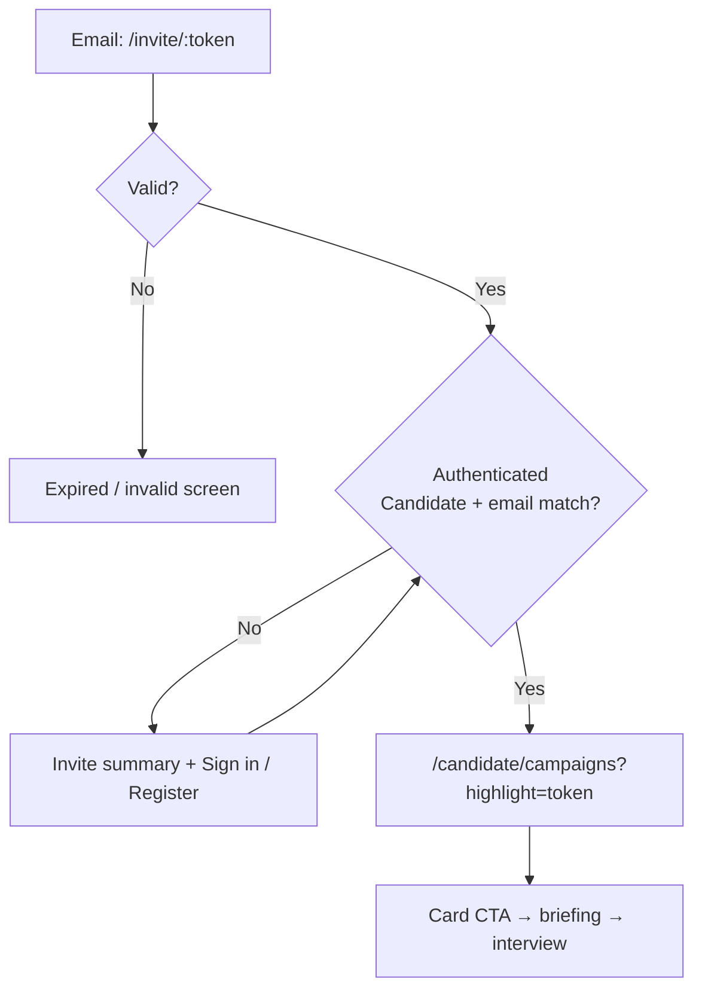

# Candidate Campaigns & Magic Link Entry

> **Product decision (2026-07-13, supersedes 2026-07-12 browse deprecation):** B2B candidates see **only campaigns they were invited to** at `/candidate/campaigns`. **Public browse/enroll** (`list all open campaigns`) remains **out of scope**. Magic link (`/invite/:token`) is an **email entry gate** that lands on the campaigns hub — not a briefing or interview screen.

**See also:** [`product-scope.md`](./product-scope.md) §4.5–4.7 · [`module-scope.md`](./module-scope.md) · [`campaign-assessment.md`](./campaign-assessment.md)

---

## Two candidate channels (B2C vs B2B)

| Channel | Sidebar | Entry | Data source |
| --- | --- | --- | --- |
| **B2C Practice** | **Luyện phỏng vấn** → `/practice` | Candidate self-serve | `campaign_id = null`; token wallet reserve/settle |
| **B2B Campaigns** | **Chiến dịch** → `/candidate/campaigns` | Employer invite (+ magic link email) | Invites linked to `candidate_id` / email |

**Interview history** (`/candidate/practice/history`) covers completed sessions from **both** channels.

---

## `/candidate/campaigns` — My invited campaigns (IN SCOPE)

### Purpose

Single hub for employer-invited assessments. **Not** a marketplace.

### When the list has items

| Condition | Visible on list |
| --- | --- |
| HR added candidate email and email **already registered** as Candidate (BR-B2B-07) | Row appears with status `invited` (or later pipeline statuses) |
| Candidate completed magic link auth after invite | Same — invite already linked to account |
| Candidate opens sidebar without any invites | **Empty state** |

### Empty state copy (bilingual)

> Chưa có chiến dịch nào. Bạn sẽ thấy ở đây khi nhà tuyển dụng mời qua email đã đăng ký trên hệ thống.

### Card UI

Each invite card shows:

- Campaign title, company
- Deadline / expiry
- Status: `invited` | `in_progress` | `completed` | `expired` (and future pipeline statuses)
- CTA: **Bắt đầu** (invited) or **Tiếp tục** (in_progress)

### Briefing & assessment start

1. Candidate clicks **Bắt đầu** / **Tiếp tục** on a card.
2. Navigate to `/candidate/campaigns/:token/briefing` — campaign info, instructions, proctoring notice (`CampaignBriefingPanel`).
3. **Start assessment** → shared engine `/interview/campaign-{id}/prepare` → device → terms → identity → room (see [`campaign-assessment.md`](./campaign-assessment.md)).

---

## `/invite/:token` — Magic link (email gate only)

Magic link **does not** show briefing or start the interview directly.

### Responsibilities

1. **Validate** token (valid / expired / invalid).
2. **Auth branch** — sign in or register as Candidate (BR-B2B-08–10); reject wrong role / email mismatch.
3. **Redirect** authenticated candidate → `/candidate/campaigns?highlight={token}` (optional query highlights the card from the email).

### Flow

---

## Employer side (unchanged)

1. HR adds emails → lookup (BR-B2B-06).
2. Registered Candidate → **immediate** list row `invited` (BR-B2B-07).
3. Unknown email → `invite_pending` until registration (BR-B2B-10).
4. Publish → send magic-link email pointing to `/invite/:token`.

---

## Out of scope — public discovery (still deprecated)

| Path | Old component | Action |
| --- | --- | --- |
| `/candidate/campaigns` (browse all) | `CampaignBrowsePage` | **Replaced** by invite-only `CandidateCampaignsPage` |
| `/candidate/campaigns/:id` | `CampaignDetailPage` | **Deprecate** — redirect to `/candidate/campaigns` |
| `/candidate/campaigns/:id/enroll` | `CampaignEnrollmentPage` | **Deprecate** — redirect to `/candidate/campaigns` |

Do **not** restore filters, search, or self-enroll without an invite.

---

## Frontend stories (FS-123–126)

| ID | Story | Route / surface |
| --- | --- | --- |
| FS-123 | Candidate sidebar: **Practice** + **Campaigns** | `/practice`, `/candidate/campaigns` |
| FS-124 | Magic link validate + auth → redirect campaigns | `/invite/:token` |
| FS-125 | Campaign briefing (from card CTA) | `/candidate/campaigns/:token/briefing` |
| FS-126 | My invited campaigns list + empty state | `/candidate/campaigns` |

---

## API contract (live)

| Method | Purpose |
| --- | --- |
| `GET /api/v1/campaign/invitations/{token}` | Public invitation metadata; returns 404/410 without side effects |
| `POST /api/v1/campaign/invitations/{token}/join` | Candidate-only join; JWT is required and invitation email must match |
| `GET /api/v1/campaign/my-campaigns` | Keyset-paged campaigns joined by the authenticated Candidate |
| `GET /api/v1/campaign/my-campaigns/{id}` | Joined campaign detail and current interview state |
| `POST /api/v1/campaign/{id}/start` | Idempotently create/resume the campaign interview session |

The magic link is anonymous only for reading invitation metadata. The frontend saves
the token, sends unauthenticated users through Candidate sign-in/registration, and
calls `join` only after a Candidate JWT is available. `429` responses expose the
concurrent-interview limit and `Retry-After`/`retryAfterSeconds`; a `409` with
`code=outside_slot_window` includes server UTC timing fields for the UI.

---

## Related

- Assessment proctoring: [`campaign-assessment.md`](./campaign-assessment.md)
- Shared interview engine: [`practice-interview.md`](./practice-interview.md)
- Employer lifecycle: [`campaign-management.md`](./campaign-management.md)
