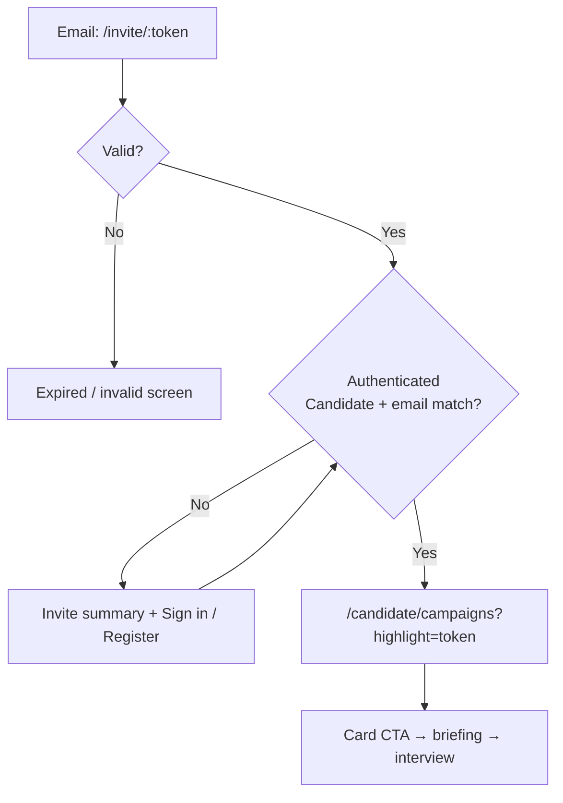

# Candidate Campaigns & Magic Link Entry

> **Shared preparation boundary (2026-08-10):** After a campaign session is created or resumed, the candidate uses the existing B2C `InterviewPrepPage` and `DeviceCheckStep` at `/interview/:sessionId/prepare`. Do not create a B2B preparation or device-check UI copy.

> **Product decision (2026-07-13, supersedes 2026-07-12 browse deprecation):** B2B candidates see **only campaigns they were invited to** at `/candidate/campaigns`. **Public browse/enroll** (`list all open campaigns`) remains **out of scope**. Magic link (`/invite/:token`) is an **email entry gate** that lands on the campaigns hub — not a briefing or interview screen.

**See also:** [`product-scope.md`](./product-scope.md) §4.5–4.7 · [`module-scope.md`](./module-scope.md) · [`campaign-assessment.md`](./campaign-assessment.md)

---

## Two candidate channels (B2C vs B2B)

| Channel | Sidebar | Entry | Data source |
| --- | --- | --- | --- |
| **B2C Practice** | **Luyện phỏng vấn** → `/practice` | Candidate self-serve | `campaign_id = null`; token wallet reserve/settle |
| **B2B Campaigns** | **Chiến dịch** → `/candidate/campaigns` | Employer invite (+ magic link email) | Invites linked to `candidate_id` / email |

**Interview history** (`/candidate/practice/history`) covers completed sessions from **both** channels.

---

## `/candidate/campaigns` — My invited campaigns (IN SCOPE)

### Purpose

Single hub for employer-invited assessments. **Not** a marketplace.

### When the list has items

| Condition | Visible on list |
| --- | --- |
| HR added candidate email and email **already registered** as Candidate (BR-B2B-07) | Row appears with status `invited` (or later pipeline statuses) |
| Candidate completed magic link auth after invite | Same — invite already linked to account |
| Candidate opens sidebar without any invites | **Empty state** |

### Empty state copy (bilingual)

> Chưa có chiến dịch nào. Bạn sẽ thấy ở đây khi nhà tuyển dụng mời qua email đã đăng ký trên hệ thống.

### Card UI

Each invite card shows:

- Campaign title, company
- Deadline / expiry
- Status: `invited` | `in_progress` | `completed` | `expired` (and future pipeline statuses)
- CTA: **Bắt đầu** (invited) or **Tiếp tục** (in_progress)
- Attempts line (ATT1-F3): “Còn {remaining}/{max} lượt”, or “Hết lượt” in the error tone when out of attempts. Shown only when the response carries both `maxAttempts` and `attemptsUsed`, and not for Completed. For states ③/④ (below) the interview-status badge is hidden because the backend reports an abandoned attempt as `NotStarted`, which would contradict the attempts message.

### Briefing & assessment start

1. Candidate clicks **Bắt đầu** / **Tiếp tục** on a card.
2. Navigate to `/candidate/campaigns/:token/briefing` — campaign info, instructions, proctoring notice (`CampaignBriefingPanel`).
3. **Start assessment** → shared engine `/interview/campaign-{id}/prepare` → device → terms → identity → room (see [`campaign-assessment.md`](./campaign-assessment.md)).

### Attempt states on the candidate campaign page (ATT1-F3)

Surface: `/candidate/campaigns/:id` (`CandidateCampaignDetailPage`, the page the card links to) plus the confirm dialog `StartCampaignConfirmDialog`. Contract: ATT1 `[C6]`–`[C8]` (hash `7e4792f993948da2`); story packet [`ATT1-frontend`](../stories/epics/ATT1-attempts-server-clock/ATT1-frontend/overview.md).

**Rules shown.** When present, the header shows “Thời lượng {n} phút” and “{n} lần làm”, and the exam-info list adds the clock rule: the clock starts when the candidate enters the interview room (after the device check) and does not stop on reload. **No countdown** is shown on the card or this page — the Campaign service does not know when the candidate entered the room, so any number would be wrong.

**Four states.** Out-of-attempts is decided **only** from `attemptsUsed` / `maxAttempts` (or a `409 ATTEMPT_LIMIT_REACHED`), never from `interviewStatus` — the backend reports an abandoned attempt as `NotStarted`.

| # | Condition | UI |
| --- | --- | --- |
| ① Not started | `attemptsUsed` = 0 (or any case not covered by ②–④) | **Bắt đầu bài phỏng vấn** → confirm dialog |
| ② In progress | `interviewStatus = InProgress` | “Đang làm dở” + **Tiếp tục bài phỏng vấn** (calls `start` again to rebuild the room marker; no dialog) |
| ③ Retake available | `lastAttemptAbandoned` and `attemptsUsed < maxAttempts` | “Lượt {n} đã kết thúc mà chưa có câu trả lời nào được chấm.” · “Còn {remaining}/{max} lượt — lượt mới có bộ câu hỏi khác.” · **Làm lại lượt {n+1}** → confirm dialog |
| ④ Out of attempts | `attemptsUsed ≥ maxAttempts`, not InProgress / Completed | “Bạn đã dùng hết {used}/{max} lượt…” + “Liên hệ nhà tuyển dụng nếu buổi thi gặp sự cố.” — **no button** |

Completed keeps the existing completed badge. In ③/④ the “Chưa bắt đầu” badge and the “Bài thi đã được bắt đầu.” line are hidden (they would contradict the attempts message).

**Confirm dialog** (Bắt đầu / Làm lại): bullet lines “Bài thi {n} phút, tính từ lúc vào phòng.”, “Bạn có {n} lượt.” plus the resume rule (leaving mid-way can be resumed within the remaining time; time-up auto-submits), and — **only on a retake** — “Đây là lượt {n}/{max} — bộ câu khác.” Confirm label: **Vào bước chuẩn bị**.

**Start errors.** `409 { code: "ATTEMPT_LIMIT_REACHED", attemptsUsed, maxAttempts }` [C8] → dedicated message, confirm button disabled (Cancel still works), and my-campaigns list + detail queries are invalidated so the page re-renders as ④. The service reads `code` before HTTP status.

**Backend-compatibility.** The frontend ships to production **before** Backend ATT1. Any missing field ⇒ `undefined` (no defaults are invented): the page, card and dialog behave exactly as before ATT1 — the start button is never hidden because fields are missing. `start` responses whose `questions[].content` is `""` [C7] are kept (only items without `id` are dropped); `attemptNo` and `timeLimitMinutes` from `start` are parsed when present. `start.deadlineAt` keeps its old meaning (hard campaign/slot deadline), not the sitting clock.

---

## `/invite/:token` — Magic link (email gate only)

Magic link **does not** show briefing or start the interview directly.

### Responsibilities

1. **Validate** token (valid / expired / invalid).
2. **Auth branch** — sign in or register as Candidate (BR-B2B-08–10); reject wrong role / email mismatch.
3. **Redirect** authenticated candidate → `/candidate/campaigns?highlight={token}` (optional query highlights the card from the email).

### Flow

```mermaid
flowchart TD
  A["Email: /invite/:token"] --> B{Valid?}
  B -->|No| E["Expired / invalid screen"]
  B -->|Yes| C{Authenticated\nCandidate + email match?}
  C -->|No| D["Invite summary + Sign in / Register"]
  D --> C
  C -->|Yes| F["/candidate/campaigns?highlight=token"]
  F --> G["Card CTA → briefing → interview"]
```

---

## Employer side (unchanged)

1. HR adds emails → lookup (BR-B2B-06).
2. Registered Candidate → **immediate** list row `invited` (BR-B2B-07).
3. Unknown email → `invite_pending` until registration (BR-B2B-10).
4. Publish → send magic-link email pointing to `/invite/:token`.

---

## Out of scope — public discovery (still deprecated)

| Path | Old component | Action |
| --- | --- | --- |
| `/candidate/campaigns` (browse all) | `CampaignBrowsePage` | **Replaced** by invite-only `CandidateCampaignsPage` |
| `/candidate/campaigns/:id` | `CampaignDetailPage` | **Deprecate** — redirect to `/candidate/campaigns` |
| `/candidate/campaigns/:id/enroll` | `CampaignEnrollmentPage` | **Deprecate** — redirect to `/candidate/campaigns` |

Do **not** restore filters, search, or self-enroll without an invite.

---

## Frontend stories (FS-123–126)

| ID | Story | Route / surface |
| --- | --- | --- |
| FS-123 | Candidate sidebar: **Practice** + **Campaigns** | `/practice`, `/candidate/campaigns` |
| FS-124 | Magic link validate + auth → redirect campaigns | `/invite/:token` |
| FS-125 | Campaign briefing (from card CTA) | `/candidate/campaigns/:token/briefing` |
| FS-126 | My invited campaigns list + empty state | `/candidate/campaigns` |

---

## API contract (live)

| Method | Purpose |
| --- | --- |
| `GET /api/v1/campaign/invitations/{token}` | Public invitation metadata; returns 404/410 without side effects |
| `POST /api/v1/campaign/invitations/{token}/join` | Candidate-only join; JWT is required and invitation email must match |
| `GET /api/v1/campaign/my-campaigns` | Keyset-paged campaigns joined by the authenticated Candidate; ATT1 adds `timeLimitMinutes`, `maxAttempts`, `attemptsUsed`, `lastAttemptAbandoned` [C6] |
| `GET /api/v1/campaign/my-campaigns/{id}` | Joined campaign detail and current interview state; same ATT1 fields [C6] |
| `POST /api/v1/campaign/{id}/start` | Idempotently create/resume the campaign interview session; ATT1 adds `attemptNo`, `timeLimitMinutes`, hides question content until `begin` [C7]; `409 ATTEMPT_LIMIT_REACHED` when out of attempts [C8] |

The magic link is anonymous only for reading invitation metadata. The frontend saves
the token, sends unauthenticated users through Candidate sign-in/registration, and
calls `join` only after a Candidate JWT is available. `429` responses expose the
concurrent-interview limit and `Retry-After`/`retryAfterSeconds`; a `409` with
`code=outside_slot_window` includes server UTC timing fields for the UI.

### Invitation email mismatch

If `POST /api/v1/campaign/invitations/{token}/join` rejects a signed-in Candidate
because their account email differs from the invited email, the gateway must return
an explicit error marker (currently `code=INVITATION_EMAIL_MISMATCH`, or the
equivalent specific message such as `Email đăng nhập không khớp với email được mời.`).
The client renders a stable mismatch state only for
that marker, shows the current authenticated email when available, preserves the
token in session storage, signs the user out through the shared auth flow, and
returns them to the original invite after sign-in. Other `403` responses remain
generic forbidden errors.

---

## Related

- Assessment proctoring: [`campaign-assessment.md`](./campaign-assessment.md)
- Shared interview engine: [`practice-interview.md`](./practice-interview.md)
- Employer lifecycle: [`campaign-management.md`](./campaign-management.md)
