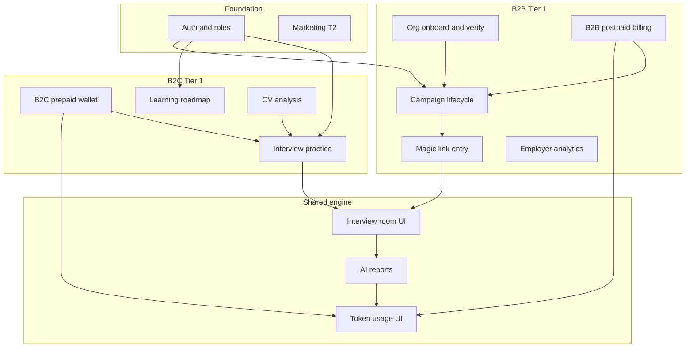

# ISAS Frontend — Module Scope

**Status:** v1 (from Product Discovery)  
**Parent:** [`product-scope.md`](./product-scope.md)

Maps Tier 1/2/3 to frontend modules, routes, and screen inventory. Compares **product truth** vs **current `src/routes`**.

---

## 1. Module map (tier → product module)

| Product module | Tier | Product contract | Route group | Implementation status |
| --- | --- | --- | --- | --- |
| Public marketing | T2 | Home, pricing, enterprise story | `publicRoutes` | Partial |
| Auth & session | T1 | Login, register, verify, reset, MFA, errors | `authRoutes` | Implemented |
| Auth modal (shell) | T1 | Marketing layout modal flow | `MarketingLayout` | Implemented |
| Candidate profile | T1 | Profile, completeness, career data | `candidateRoutes` `/candidate/profile*` | Implemented (mock) |
| Candidate dashboard | T1 | Dashboard, heatmap, metrics | `/candidate/dashboard` | Implemented (mock) |
| CV analysis | T1 | Upload + report (within practice flow) | `/candidate/cv/analysis*` | Implemented (mock) |
| Interview practice (B2C) | T1 | Entry, prep, room, result, history | `interviewRoutes`, practice history | In progress |
| Learning roadmap | T1 | Roadmap, milestones, lessons | `/candidate/roadmap` | Partial |
| Payment B2C | T1 | Wallet, checkout, token usage | `/candidate/credits`, payment | Not started / mock |
| Usage & billing UI | T1 | Token history, estimates, settle display | Candidate route missing; employer invoices implemented | Partial |
| Payment B2B | T1 | Monthly usage, invoices | `/employer/billing`, `/employer/invoices` | Implemented (mock, Phase 15 E2E covered) |
| Org onboarding | T1 | Company profile, verify | `/employer/company*` | Implemented (mock) |
| Campaign management | T1 | List, wizard, detail, publish | `/employer/campaigns*` | Implemented (mock) |
| Candidate selection | T1 | Upload CV/email, screening, ranking, **email lookup → immediate list if registered** | Partial in wizard/pipeline | Partial |
| Employer analytics | T1 | Pipeline, candidate profile, report, export | `/employer/analytics`, candidates | Implemented (mock) |
| Magic link (B2B entry) | T1 | Invite landing → auth → interview | `/invite/:token` | Implemented |
| **Public campaign browse** (self-serve catalog of all open campaigns) | — | **OUT OF SCOPE** |
| **My invited campaigns** | T1 | Employer-invited list only | `/candidate/campaigns` | Required |
| Learning hub | T3 | Standalone content library | `/candidate/learning*` | Placeholder — backlog |
| Leaderboard | T2 | Rankings | `/candidate/leaderboard` | Placeholder |
| Certificate | T2 | Certificate viewer | `/candidate/certificates/:id` | Placeholder |
| Achievements / progress | T2/T3 | Gamification | `/candidate/achievements`, `progress` | Placeholder |
| Admin portal | T1 | Users, tenant, audit, AI config | `/admin/*` | Placeholder only |
| Transactional email | T1 | Backend-driven; frontend triggers only | — | Not started |

---

## 2. Persona → entry points

| Persona | Primary entry | Key navigation |
| --- | --- | --- |
| Guest | `/`, `/pricing`, `/enterprise` | Register, login |
| Candidate | `/candidate/dashboard` | **Practice**, **Campaigns** (invited only), roadmap, credits, history, profile |
| HR | `/employer/dashboard` | Campaigns, candidates, analytics |
| Organize | `/employer/dashboard`, `/employer/company` | Verify, billing (TBD routes), HR mgmt (TBD) |
| Admin | `/admin` | Internal ops only |
| B2B candidate | `/invite/:token` → `/candidate/campaigns` | Auth gate → my campaigns hub → briefing → interview |

**Navigation (candidate sidebar):**

| Item | Route | Notes |
| --- | --- | --- |
| Luyện phỏng vấn / Practice | `/practice` | B2C session create (token reserve) |
| Chiến dịch / Campaigns | `/candidate/campaigns` | B2B invites only; empty if none |
| Lịch sử phỏng vấn / History | `/candidate/practice/history` | Completed B2C + B2B sessions |

**Navigation rule:** No public campaign catalog. Magic link emails land on `/candidate/campaigns` after auth.

---

## 3. Screen inventory — implemented routes

Source: `src/routes/groups/*.tsx` (as of discovery).

### Public & marketing (T2)

| Route | Screen | Tier | Notes |
| --- | --- | --- | --- |
| `/` | Home | T2 | |
| `/pricing` | Pricing | T2 | |
| `/enterprise` | Enterprise marketing | T2 | |
| `/terms`, `/privacy` | Legal | T2 | |
| `/invite/:token` | Magic link auth gate | **T1** | Redirect → `/candidate/campaigns` |
| `/403`, `/404`, `/500`, `/maintenance` | Errors | T1/T2 | |

### Auth (T1)

| Route | Screen |
| --- | --- |
| `/login`, `/register` | Login, register |
| `/verify-email` | Email verification |
| `/forgot-password`, `/forgot-password/verify`, `/reset-password` | Password recovery |
| `/mfa` | Two-factor |
| `/session-expired`, `/account-locked`, `/access-denied` | Session / access states |

### Candidate shell (T1)

| Route | Screen | Tier | Product fit |
| --- | --- | --- | --- |
| `/candidate/dashboard` | Dashboard | T1 | Keep |
| `/candidate/profile` (+ subpages) | Profile | T1 | Keep |
| `/candidate/cv/analysis` | CV wizard | T1 | Keep |
| `/candidate/cv/analysis/report` | CV report | T1 | Keep |
| `/candidate/practice/history` | Interview history | T1 | Keep |
| `/candidate/practice/history/:id` | Result detail | T1 | Keep |
| `/candidate/practice/history/compare` | Compare results | T1 | Keep |
| `/candidate/roadmap` | Learning roadmap | T1 | Keep |
| `/candidate/credits` | Wallet | T1 | Update for tokens |
| `/candidate/subscription` | Plans | T1 | Review vs token model |
| `/candidate/payment` | Checkout | T1 | Keep |
| `/payment/callback` | PayOS callback | T1 | Keep |
| `/candidate/campaigns` | **My invited campaigns** | T1 | Invite-only list; empty state |
| `/candidate/campaigns/:token/briefing` | Campaign briefing | T1 | Before assessment start |
| `/candidate/campaigns/:id` | Legacy detail | — | Redirect → `/candidate/campaigns` |
| `/candidate/campaigns/:id/enroll` | Legacy enroll | — | Redirect → `/candidate/campaigns` |
| `/candidate/learning` | Learning hub | T3 | Backlog |
| `/candidate/learning/:moduleId` | Learning module | T3 | Backlog |
| `/candidate/progress` | Progress dashboard | T2 | Simplify |
| `/candidate/leaderboard` | Leaderboard | T2 | Simplify |
| `/candidate/achievements` | Achievements | T2 | Simplify |
| `/candidate/certificates/:id` | Certificate | T2 | Simplify |

### Interview engine (T1 — shared B2C / B2B)

| Route | Screen |
| --- | --- |
| `/practice` | Practice entry / session create |
| `/practice/result` | Result (legacy path) |
| `/interview/:sessionId/prepare` | Preparation |
| `/interview/:sessionId/device-check` | Device check |
| `/interview/:sessionId/identity` | Identity verification |
| `/interview/:sessionId/waiting` | Waiting room |
| `/interview/:sessionId/room` | Interview room |
| `/interview/:sessionId/complete` | Completion |

### Employer (T1)

| Route | Screen | Role |
| --- | --- | --- |
| `/employer/dashboard` | Employer dashboard | HR, Organize |
| `/employer/company` | Company profile | Organize |
| `/employer/company/verify` | Verification | Organize |
| `/employer/campaigns` | Campaign list | HR, Organize |
| `/employer/campaigns/new` | Create campaign | HR, Organize |
| `/employer/campaigns/:id` | Campaign detail | HR, Organize |
| `/employer/campaigns/:id/edit` | Edit campaign | HR, Organize |
| `/employer/campaigns/:id/candidates` | Candidate pipeline | HR, Organize |
| `/employer/candidates/:id` | Candidate profile | HR, Organize |
| `/employer/candidates/:id/report` | AI report | HR, Organize |
| `/employer/analytics` | Analytics + export | HR, Organize |

### Admin (T1 — internal)

| Route | Screen | Status |
| --- | --- | --- |
| `/admin` | Dashboard shell | Placeholder |
| `/admin/users` | User management | Placeholder |

**Missing admin screens (Tier 1):** tenant mgmt, audit logs, AI config, role/permission mgmt, financial overview.

### Missing routes (Tier 1 — product required, not in router)

| Needed screen | Persona | Suggested area |
| --- | --- | --- |
| Candidate token usage history | Candidate | `/candidate/usage` or wallet tab |
| Candidate selection (upload list, screening UI) | HR | Wizard step or `/employer/campaigns/:id/selection` |
| Invitation email preview | HR | Publish flow step |
| Organize HR team management | Organize | `/employer/team` |
| Campaign briefing + terms | Candidate | `/invite/:token` or prepare step |
| Violation pause overlay | Candidate | Modal on `/interview/:sessionId/room` |
| Campaign assessment spec | — | [`campaign-assessment.md`](./campaign-assessment.md) |

---

## 4. Module dependencies (product level)

---

## 5. Reconcile — campaigns vs public browse

**Product decision (2026-07-13):** [`campaign-discovery.md`](./campaign-discovery.md)

| Item | Action |
| --- | --- |
| `/candidate/campaigns` | **Keep** — **my invited campaigns** (sidebar); empty if no invites |
| `/candidate/campaigns/:token/briefing` | **Add** — briefing before assessment |
| `/candidate/campaigns/:id`, `.../enroll` | **Deprecate** — redirect to `/candidate/campaigns` |
| `/invite/:token` | **Keep** — auth gate only → redirect `/candidate/campaigns?highlight={token}` |
| `/practice` | **Sidebar** — B2C practice entry |
| Public browse (`CampaignBrowsePage`, filters, self-enroll) | **Out of scope** — do not restore |

**Rationale:** Employers invite by email; candidates see only linked campaigns. Magic link is not the interview UI.

---

## 6. BRD screen inventory delta (summary)

BRD `Screen_Inventory.md` lists 100+ screens. Frontend product scope **does not** require implementing every BRD screen for capstone beta.

| BRD area | Product stance |
| --- | --- |
| SCR-CAN-023–025 (public discovery) | Out of scope |
| SCR-CAN-040–041 (learning hub) | Tier 3 |
| SCR-CAN-044–045 (leaderboard, achievements) | Tier 2 |
| SCR-ADM-069+ | Tier 1 but mostly **not built** |
| SCR-EMP-063–068 (billing, team) | Tier 1 — **routes missing** |

Use this file + [`product-scope.md`](./product-scope.md) as frontend product truth until BRD is formally updated.

---

## 7. Implementation priority (suggested backlog order)

1. Token billing UX (B2C reserve/settle, B2B usage views) — aligns payment with product-scope §5
2. Deprecate public campaign discovery routes + docs
3. Complete interview practice E2E (live services)
4. B2B candidate selection + publish email preview
5. Learning roadmap depth (lessons, milestone gates)
6. Employer billing / invoice screens (Organize)
7. Admin portal (internal)
8. Tier 2 polish (marketing, leaderboard, certificate)
